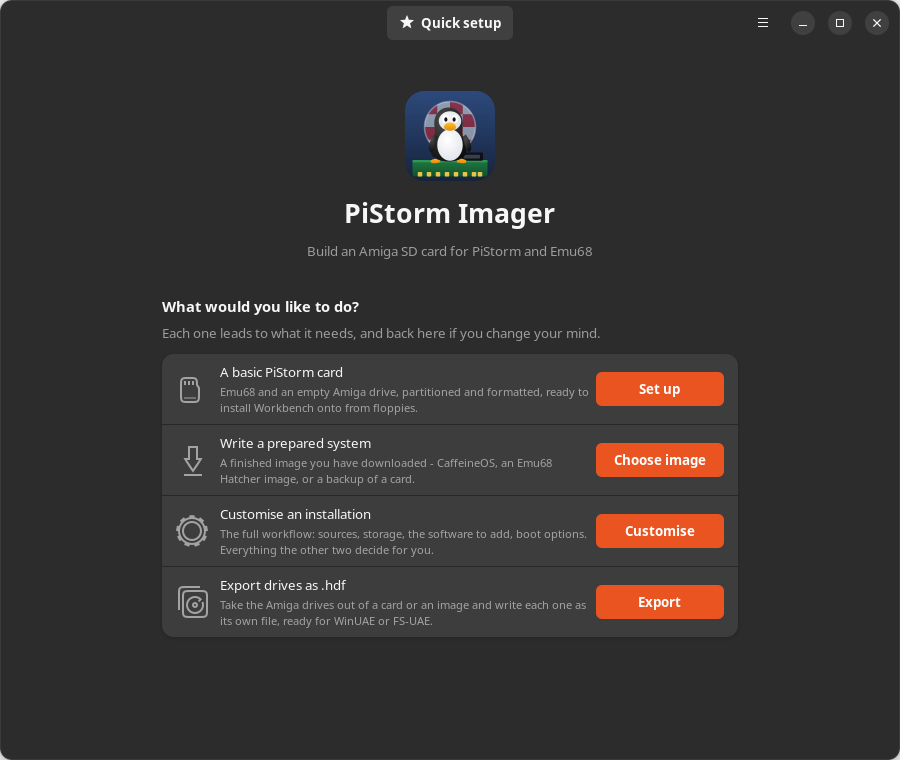
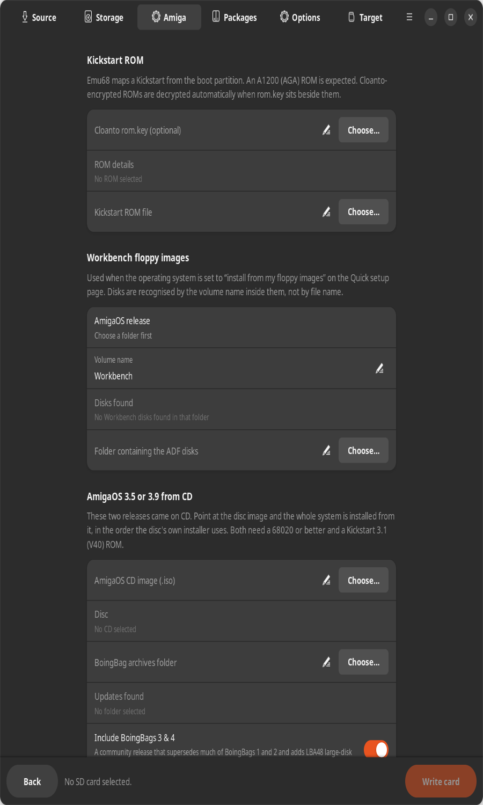
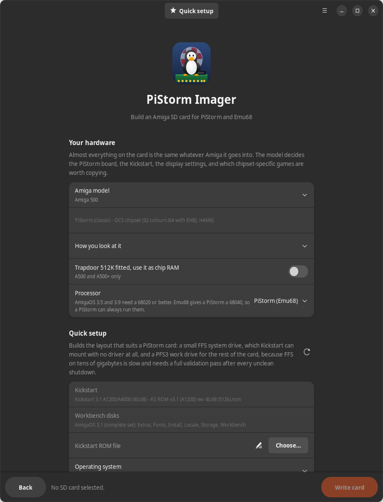
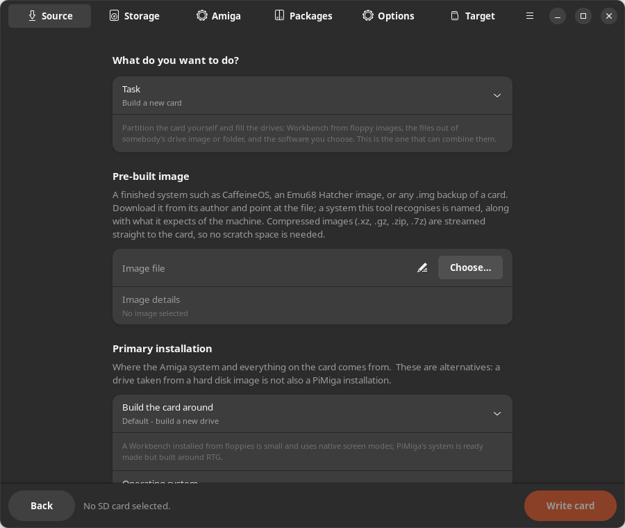
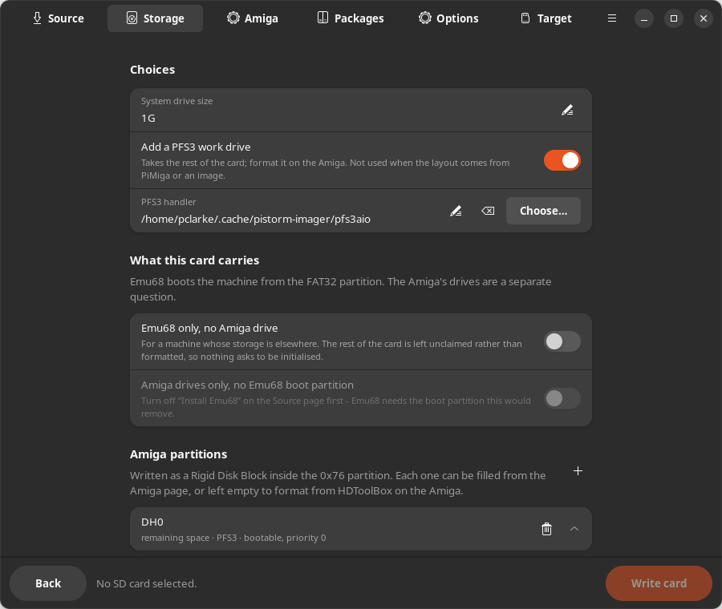
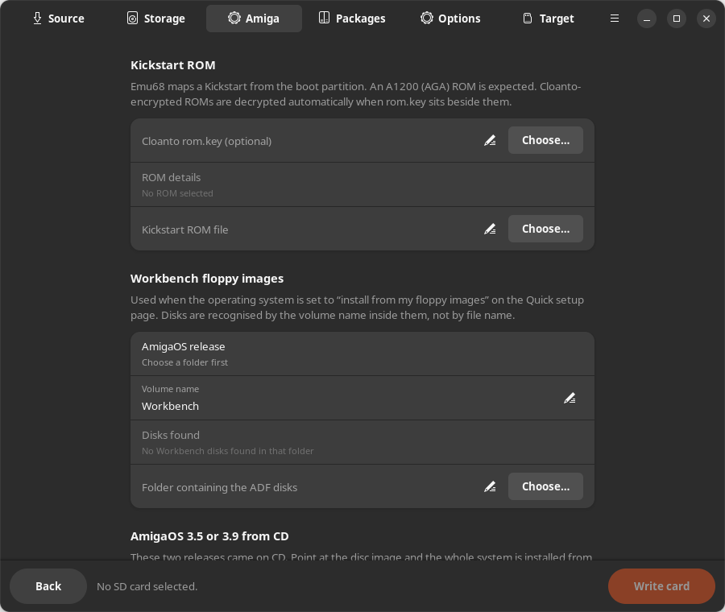
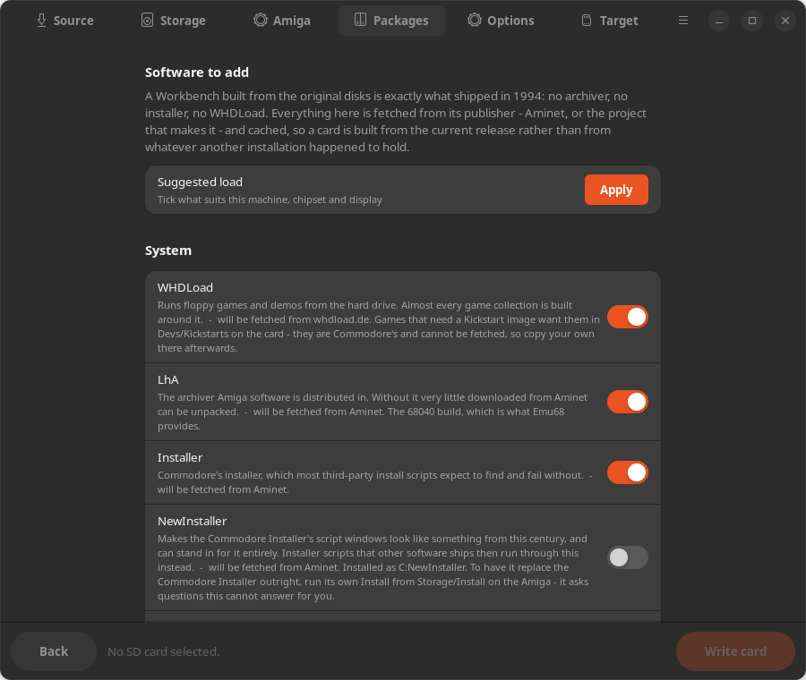
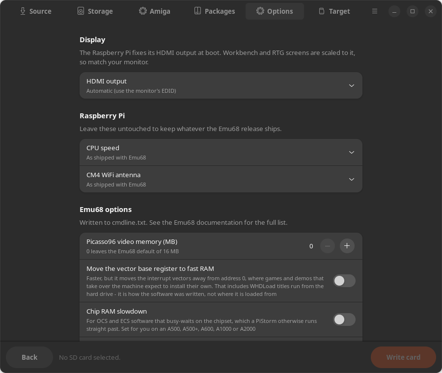
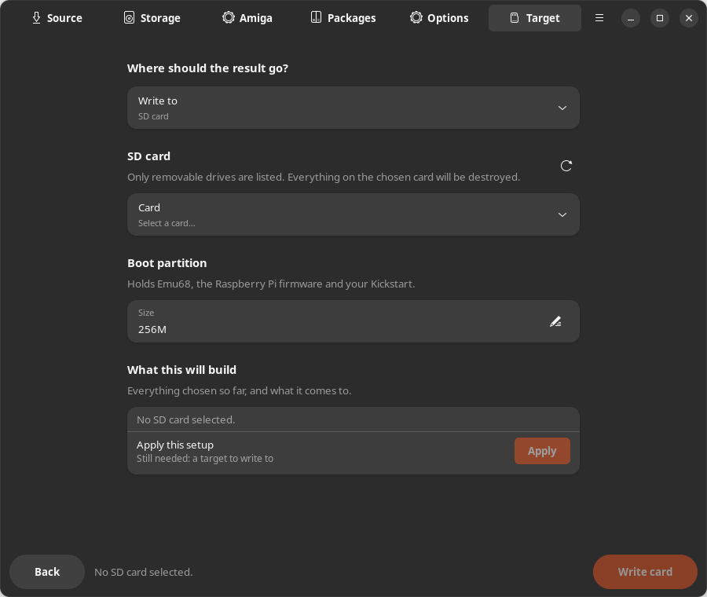
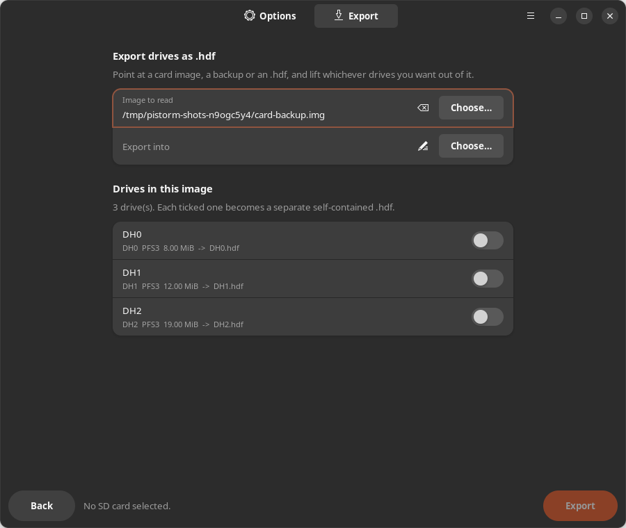

# PiStorm Imager for Linux

A GTK4 desktop application for preparing PiStorm / Emu68 SD cards on Linux.

The official [Emu68 Imager](https://mja65.github.io/Emu68-Imager/) is Windows and
PowerShell only. This is a native Linux replacement, and it additionally
understands pre-built images such as **PiMiga**, so you can write one to a card
and still apply your own Emu68 build, Kickstart, video mode and WiFi settings on
top of it.



## What it does

Four tasks that write a card, all ending with the same boot-partition
customisation pass, and a fifth that writes no card at all - **Export drives as
.hdf**, described below. Two of the four take a `.hdf`, and the difference
between them is the whole point: **Write
a drive image unchanged** keeps the image's own partitions and file systems and
adds nothing, while **Build a new card** can take the *files* out of that same
image, put them on a layout of your choosing, and add the Workbench disks and
software to them. That is why a ClassicWB card is built with the second: its
drive brings no Workbench, so it needs the floppies alongside it.

| Task | What happens |
| --- | --- |
| **Build a new card** | Writes an MBR with a FAT32 boot partition (Emu68 + Raspberry Pi firmware + your Kickstart) and a type `0x76` Amiga partition carrying a Rigid Disk Block. Optionally installs AmigaOS onto it from a set of Workbench floppy images, so the card boots straight to Workbench. |
| **Write a pre-built image** | Streams PiMiga, an Emu68 Hatcher image or a backup of your own card onto the target, then re-applies your Emu68 build and settings. Optionally turns the card's leftover space into a new Amiga partition. |
| **Write a drive image unchanged** | Takes a WinUAE/FS-UAE/HstWB `.hdf` - the Amiga drive on its own, with no partition table - and builds the boot partition around it. Images with no Rigid Disk Block get one generated for them, and a whole card image such as PiMiga can be used here too: only its Amiga drive is taken, so it can be moved onto a card of a different size with a fresh boot partition. Every imported drive is checked for PiStorm compatibility and repaired. |
| **Update an existing card** | Touches only the boot partition: swap the Emu68 version, change the Kickstart, alter the HDMI mode, add WiFi. Everything on the Amiga side is left alone. |

**A card can also carry Emu68 and nothing else.** Some machines keep their
storage elsewhere - a second card in a CF adapter, a real disk on the IDE port -
and want the SD to be the boot partition and no more. *Emu68 only, no Amiga
drive* on the Storage page does that: the MBR gets **one** entry, and the rest of
the card is left unclaimed.

An empty Amiga partition is not the same answer, which is why this is a switch
rather than a layout with nothing in it. An empty partition still takes the rest
of the card, still appears on the desktop, and still asks to be initialised -
and the space cannot be given to anything else. With no entry at all the card
says what it is.

The choice hides the layout rather than clearing it, so turning it off brings
back exactly the drives that were there. And because a boot-only card has
nowhere to put a Workbench install, a package or a folder of games, the build
**says so before it starts** rather than quietly dropping them - the ticks stay
where they are.

All of them are offered on the first screen, which is a choice of what to do
rather than a page of settings that happens to be first. It carries a masthead
so the choice sits in the window instead of clinging to the top of it: three
rows above a large empty area read as though something had failed to load, and
each task now has an icon and a button in one column.

The fifth task writes no card at all. **Export drives as .hdf**
reads the Amiga drives back *out* of a card, a backup or an `.hdf`, and writes
each one you tick as its own file.

This replaces an option that was quietly wrong. "Write to: Amiga hard disk
image (.hdf)" used to write the build's *output* as one bare drive - and a
PiStorm card normally carries four, a system drive, games, demos and a work
drive, so a single bare file could not say which of them it was. Reading drives
back out is a different job, and it now has its own page rather than a third
entry in a list about where to write a card.

Each file is **self-contained**: its own Rigid Disk Block naming the drive, and
the file system handler the source card embedded copied in beside it. That is
what self-contained has to mean for PFS3, which no emulator has built in - a
bare copy of those blocks cannot be mounted without the handler, and the volume
name goes with it. Verified against a real card: `DH2` came out as `Demos.hdf`
carrying PFS3 19.2 in 59,532 bytes, and the volume mounts as `Demos`.

The drives are **read from the image, never guessed**: choose a file and the
page lists what is actually in it, by the name a person calls it, with the file
each one would become. Every one starts **unticked**, and Export stays disabled
until at least one is chosen - unticking them all disables it again. The rest
of this application defaults to what is already there, but this page writes new
files and a games drive is twenty gigabytes, so exporting all four because
nobody said otherwise is not a sensible default. A drive whose name cannot be read is still offered -
being unreadable here is a reason to hand it to something else, not a reason to
leave it out.

Along the way it will:

* download the right Emu68 release for your board, **including the 1.1 asset
  rename** (`Emu68-pistorm.zip` meant the classic PiStorm up to 1.0.7 and means
  the FPGA boards from 1.1 onwards), and fetch the Raspberry Pi boot firmware
  separately for releases that no longer bundle it;
* identify Kickstart ROMs by looking *inside* them rather than by file name,
  warn when a ROM is not an A1200/AGA one, decrypt Cloanto `AMIROMTYPE1` ROMs
  when `rom.key` is available, and silently correct byte-swapped dumps;
* edit the `config.txt` that ships with your chosen Emu68 release rather than
  generating a new one, so upstream's comments and per-release tuning survive
  and only the keys you actually set are changed;
* write `cmdline.txt` from the documented Emu68 options (`vc4.mem`, `vbr_move`,
  `chip_slowdown`, `sd.unit0=rw`, and anything else you type in);
* install AmigaOS from ADFs, recognising each disk by the **volume name inside
  it** rather than its file name, and keeping the whole set to one release (a
  2.0 Extras drawer on a 3.1 system is a broken install, and collections
  routinely hold several releases side by side);
* install **AmigaOS 3.5 and 3.9 from their CD images**, with their BoingBags
  on top - described below.

## AmigaOS 3.5 and 3.9

Both were sold on CD rather than floppy, so they are a source of their own
rather than another release in the ADF list. Point at the `.iso` and the whole
system is installed from it.



### The layout comes from the disc, not from guesswork

Every source and destination is read out of the installer script each disc
carries - `OS-Version3.5/OS3.5Install` and `OS-Version3.9/OS3.9Install`, which
are plain Installer text. That matters because several of them are not the
obvious answer, and a wrong destination makes a system that *looks* installed:
`Extras/Backdrops` goes to `Prefs/Presets/Backdrops` and not to `Backdrops`,
and the printer and keymap sets are lifted out of the Workbench tree's own
`Storage` and copied again into `Devs`.

### Neither release is one tree, and the two discs differ

| | 3.5 disc | 3.9 disc |
| --- | --- | --- |
| 3.1 base | `OS-Version3.1/Workbench3.1` + `Extras3.1` | not needed |
| 3.5 | `OS-Version3.5/Workbench` - a *delta* | `Workbench3.5` - complete |
| 3.9 | - | `Workbench3.9`, over the 3.5 tree |

The 3.5 disc's own Workbench tree has no `S`, no `WBStartup` and no `Rexxc`,
because it was meant to land on an existing Workbench 3.1 - which that disc
also supplies. Copy it alone and the drive has no Startup-Sequence at all.

The layering is resolved on a staging tree on Linux and the volume written once
from it. That is not tidiness: this project's volume writer creates files and
never overwrites them, so whatever lands first wins. Copying 3.5 and then 3.9
straight onto a volume would keep the *3.5* file every time both discs carry the
same name - which is every important file on the disc, and exactly backwards.

### Two extensions, because the two discs need different ones

Names are read from Joliet where there is one, then a Rock Ridge `NM` entry,
then the plain ISO name. The 3.5 disc answers through Joliet; the 3.9 disc
through Rock Ridge, and getting that wrong is not cosmetic. Its plain ISO names
are upper case, so a reader that stopped there would put `AMIDOCK` and
`DEFICONS` in WBStartup - Workbench draws an icon's label from the file name, so
the desktop would shout, and every startup line and tool type this project
retargets would be matched against a spelling that was never on the disc.

### The BoingBags

The update packs are applied on top, oldest first, and they are not all the
same shape:

| Pack | What it is | Applied by |
| --- | --- | --- |
| BoingBag 3.5-1, 3.5-2 | plain trees | copying |
| BoingBag 3.9-3&4 | 995 plain files, community | copying |
| BoingBag 3.9-1, 3.9-2 | fixes inside an encrypted archive | its own Updater |

BoingBags 1 and 2 for 3.9 keep every system file they fix in `AmigaOS-Update`,
a ZIP in which every entry is encrypted; the password lives inside Haage &
Partner's `Updater`, and their installer simply runs
`C/Updater AmigaOS-Update <target>`. So this project runs **their** tool rather
than trying to open their archive: the staged tree is mounted as a directory
drive in FS-UAE and `Updater` writes its results straight back into it.

Two things about that were found by watching a run rather than by reasoning
about it. `Updater` will not do anything until it has seen the disc - it asks
for "volume AmigaOS3.9 in any drive" - so the CD is laid out as a directory and
that drive is *labelled* `AmigaOS3.9`; no CD emulation is involved, which
matters because CacheCDFS is itself on the disc. And XAD, which it depacks with,
refuses to write over a file that already exists, so the files the payload
carries are moved aside first - and **moved, not deleted**: put back if the run
does not finish, because an update that fails half way would otherwise leave the
system missing the files it was meant to improve.

Where FS-UAE is not installed, the files that are in the clear are still applied
and the build names, file by file, the fixes it could not make. "Some fixes were
skipped" is not something anyone can act on; the list is what tells you whether
the thing you are chasing is in it.

### The processor, and the Kickstart

Both releases need a 68020 or better and a Kickstart 3.1 (V40). The machine
profiles now carry a processor, and it distinguishes three cases: a stock
machine, a stock machine with an accelerator fitted, and a PiStorm - where Emu68
replaces the processor with a 68040-class core.

```
a500   stock       KS V40: needs MC68020 or better, has MC68000   refused
a500   accelerator KS V40: allowed
a500   pistorm     KS V40: allowed
a500   pistorm     KS V37: needs Kickstart 3.1 (V40), ROM is V37  refused
a1200  stock       KS V47: needs Kickstart 3.1 (V40), ROM is V47  refused
```

A PiStorm clears the processor requirement on every machine, so that check can
only ever refuse a stock machine or an under-specified accelerator. It is
recorded anyway: the requirement belongs to AmigaOS rather than to today's
accelerator, and the reason a release is offered or refused should be stated
where the decision is made rather than left implicit in the fact that nothing
currently violates it.

## Requirements

Everything is either in the Python standard library or already on a normal
GNOME desktop:

```
sudo apt install python3-gi gir1.2-gtk-4.0 gir1.2-adw-1 dosfstools
```

`p7zip-full` is only needed for `.7z`/`.rar` source images. There is no
`mtools`, `amitools` or `parted` dependency: the FAT32 and RDB layers are
implemented in this project.

## Running it

```
./run.sh
```

or install it from the published release and use the desktop entry:

```
pipx install --system-site-packages \
    "git+https://github.com/peteclarke-del/pistorm-linux@v0.8.0"
pistorm-imager-cli install-desktop
```

`--system-site-packages` is not optional: PyGObject is a distribution package,
and an isolated environment cannot see it, so the application dies on
`ModuleNotFoundError: No module named 'gi'`.

The second line is the one that used to be missing. `pipx` and `pip` install a
Python package and **nothing else** - they know nothing about
`~/.local/share/applications` or the hicolor icon theme - so an installed copy
had no menu entry and no icon, and appeared in the desktop's grid as a generic
drive. The two files were in the repository all along, and the documented way
to install them was a pair of `install -Dm644` lines run from a checkout, which
is exactly what somebody installing from a tag does not have.

They now travel **inside** the package, at `pistorm_imager/data`, rather than
beside it: `site-packages` holds the package and nothing else, so a path
relative to the repository root pointed at a directory that was not there. That
is also what lets a checkout and an installed copy share one code path -
`app.py` adds `pistorm_imager/data/icons` to GTK's search path either way, so
running `./run.sh` from a checkout finds the icon without installing anything.

`install-desktop` takes `--prefix` if the files should go somewhere other than
`$XDG_DATA_HOME`, and refreshes the desktop and icon caches afterwards. A
desktop that caches its application grid - GNOME does - may still need a log
out and back in before the icon appears.

## The window

It opens on a choice of what to do, and nothing else, because a choice with a
page of settings under it is not a choice - the settings are the thing being
chosen between.

| | |
| --- | --- |
| **A basic PiStorm card** | Emu68 and an empty Amiga drive, partitioned and formatted, ready to install Workbench onto from floppies. Leads to which Amiga it is for, what was found to install from, the card and its size, and the plan. |
| **Write a prepared system** | A finished image you have downloaded - CaffeineOS, an Emu68 Hatcher image, or a backup of a card. Leads to the image chooser and the card, and nothing about the machine, because the image brings its own answer to that. |
| **Customise an installation** | The full workflow: sources, storage, the software to add, boot options. Everything the other two decide for you. |
| **Export drives as .hdf** | Reads the Amiga drives back *out* of a card or an image and writes each one you tick as its own file. Writes no card at all, which is why it is a task here rather than a destination on the Target page. |

The first two lead to one screen that asks only what it needs. Choosing **A
basic PiStorm card** keeps the masthead and adds the machine, whatever Kickstart
and Workbench disks were found on this computer, the card, and the plan:



The two greyed rows are detections, not settings. They are what the scan found
to build from - here a 40.68 A1200 ROM and a complete 3.1 floppy set - and the
refresh button beside the heading looks again.

### Customising

**Customise an installation** replaces that single screen with six, reachable
in any order from the switcher along the top. Each is laid out in the order its
decisions are made.

| Page | What it asks |
| --- | --- |
| **Source** | The task - the five listed under [What it does](#what-it-does) - and where the Amiga system comes from: a new drive, a PiMiga installation, or a hard disk image. |
| **Storage** | The size of the system drive, whether the rest of the card becomes a PFS3 work drive, whether the card carries an Amiga drive at all, and the Amiga partitions themselves. |
| **Amiga** | Which Amiga the card is for, how you look at it, the Kickstart ROM, and the Workbench floppy images. |
| **Packages** | The optional software, fetched from its publisher rather than taken from a drive you happen to have. |
| **Options** | HDMI output, the Raspberry Pi's own settings, and the Emu68 switches that end up in `cmdline.txt`. |
| **Target** | Where the result goes, how big the boot partition is, and **what this will build**. |











Every route ends with the same block: **what this will build**, and `Apply this
setup` beneath it. That block finishes whichever route was taken - the last
thing on a quick screen, or the last thing on the Target page when customising -
so the same decision reads the same way whichever way it was reached.



Nothing is written until that Apply has been pressed. `Write card` stays off
before it, and goes off again whenever something changes what would actually be
written - a partition renamed two pages away puts the setup back to needing
another look, and says so beside the summary. Apply itself is offered only once
enough has been chosen for a card to boot: not merely a configuration that will
write, but one with a Kickstart for Emu68 to map and floppies for an install
from floppies. What is still wanted is named where the button is -

> Still needed: a Kickstart ROM, and 1 more

 - and a prepared image is exempt, because the image and a card are the whole
requirement.

`Back` sits bottom left, in the same bar as `Write card`, and always returns to
the choice. It withdraws the acceptance with it, so reconsidering the choice
that led to a setup does not leave Write lit while you do.

### Exporting

**Export drives as .hdf** is the one task with no card at the end of it, and its
page reads the drives out of whatever you point it at rather than guessing:



Every drive starts unticked and `Export` stays off until at least one is chosen,
because this page writes new files and a games drive is twenty gigabytes. The
button names the task too - it says `Export` here rather than `Write card`.

### The menu

| | |
| --- | --- |
| **Save settings…** | Writes exactly the job file that the `build` subcommand consumes. |
| **Load settings…** | Reads one back into the window. |
| **Forget saved setup** | Puts the window back to how it opens, discarding the session it remembered. |
| **Inspect the target** | Shows the partitions and the Rigid Disk Block of the chosen card or image. |
| **Check for updates…** | Asks GitHub for this project's releases and says what it found. |
| **About** | Version and licence. |

**Check for updates…** is asked for rather than done at startup: a tool that
prepares a card should not reach out to the internet unless someone has asked it
a question. No network, a changed API or a repository with no releases yet are
all reported as the question going unanswered, because none of them mean
anything is wrong with the copy in front of you.


## Privileges

The interface never runs as root. All downloading and unpacking happens as you;
when the target is a real SD card the writing step alone is re-executed through
`pkexec`, which means the privileged half is offline and only touches the card.
Writing to an `.img` file needs no authentication at all.

The card chooser lists only removable drives, and a device currently providing
`/`, `/home`, `/boot` and friends is refused outright.

## Command line

The same engine without the GUI:

```
python3 -m pistorm_imager.cli list-devices
python3 -m pistorm_imager.cli releases
python3 -m pistorm_imager.cli identify ~/Kickstarts/*.rom
python3 -m pistorm_imager.cli inspect /dev/mmcblk0        # partitions + RDB
python3 -m pistorm_imager.cli check disk.hdf --fix        # compatibility repair
python3 -m pistorm_imager.cli build --job saved-settings.json
```

`Save settings...` in the GUI menu writes exactly the job file that `build`
consumes, so a card can be reproduced later or on another machine.

## Layout

```
pistorm_imager/
  core/
    fat32.py     FAT32 reader/writer working directly on an image or device
    amigafs.py   Amiga OFS/FFS: reads ADFs, creates and fills FFS partitions
    amigaos.py   recognising Workbench disks and installing them
    mbr.py       DOS partition table
    rdb.py       Amiga Rigid Disk Block: partitions and embedded file systems
    emu68.py     GitHub releases, asset naming, Raspberry Pi firmware
    kickstart.py ROM identification, Cloanto decryption, byte-swap repair
    bootcfg.py   config.txt / cmdline.txt editing
    imgsrc.py    streaming readers for .img/.xz/.gz/.zip/.7z sources
    hdfcheck.py  PiStorm compatibility analysis and RDB repair
    pfs3.py      PFS3: reads real volumes, creates and fills new ones
    compat.py    automatic emulator-to-PiStorm fixes (RTG driver, startup)
    amigainfo.py Workbench .info icons, enough to retarget tool types
    machines.py  target machine profiles: chipset, processor, board,
                 Kickstart, display
    iso9660.py   reading CD images: ISO 9660 with Joliet and Rock Ridge
    amigacd.py   installing AmigaOS 3.5 and 3.9 from their CDs
    boingbag.py  the update packs for 3.5 and 3.9
    bbupdate.py  running a locked update's own Updater under FS-UAE
    emulate.py   turns a machine profile into an FS-UAE configuration
    export.py    lifting the Amiga drives back out of a card, one file each
    presets.py   turns a machine and a source into a complete build
    packages.py  optional software taken from a system you already have
    content.py   what a games or demos tree is divided into, and what runs here
    distributions.py  recognising a prepared system and what it expects
    postwrite.py adapting a prepared system after it has been written
    updates.py   asking GitHub whether there is a newer release of this tool
    devices.py   finding and describing removable drives
    prepare.py   partitioning and formatting the target
    util.py      sizes, progress reporting, stream copying
    builder.py   the orchestrator
    jobs.py      job serialisation across the privilege boundary
  ui/            the GTK4 interface
  cli.py         command line front end and privileged writer
  app.py         the GTK application itself
pistorm_imager/data/   the icon and desktop entry, in the layout they
                 install into, and shipped inside the wheel
docs/images/     the screenshots above, rendered from the real window by
                 tests/shots.py rather than captured by hand
tests/           unit tests plus a real end-to-end image build
```

## Tests

```
python3 -m unittest discover -s tests -p 'test_*.py' -v   # 735 tests
python3 tests/test_gui_smoke.py                           # needs a display
python3 tests/shots.py                # redraws the screenshots in this README
```

The core suite builds real images in a temporary directory and reads them back,
validates the FAT32 output with `fsck.vfat`, and audits the FFS bitmap to prove
no block that is in use is ever marked free. The file system tests run against
the real Workbench 3.1 disks in `samples/` when they are present.

PFS3 volumes are also booted in **FS-UAE**, which runs the real PFS3 19.2
handler out of the RDB rather than this project's reader: a small image with
Workbench 3.1 installed from the disks in `samples/`, booted to a
`S:User-Startup` that writes what it can see back onto the volume. That is the
only check that distinguishes a volume which is genuinely correct from one this
code merely agrees with itself about.

Both the ADF reader and the FFS writer were cross-checked against
[amitools](https://github.com/cnvogelg/amitools): every one of the 153 files on
the Workbench 3.1 disk extracts byte-identically to `xdftool`, and volumes
written here read back correctly in `xdftool`. That independent check matters -
a reader and writer that share a mistake agree with each other perfectly.

## Status

Working and tested end to end: partitioning, FAT32 creation and population,
Emu68 installation, Kickstart handling, `config.txt`/`cmdline.txt`, RDB
creation, image writing (including compressed sources), and expansion into
unused space. On top of that: PFS3 and FFS volumes created and filled, PiMiga
and `.hdf` drives imported and adapted, per-machine presets, the display
handling described above, optional software fetched from its publisher,
prepared systems recognised and adapted after writing, and
per-category exclusions followed through into iGame's list.

Validated against real material: a full Workbench 3.1 install built from the
original floppy images (643 files, verified in `xdftool`), a 106 GiB HstWB
`120gb.hdf` (its RDB, its PFS3 19.2 and FFS 45.13 handlers), the 500 MiB
ClassicWB `System_P96.hdf` (wrapped in a generated RDB), and a collection of
about 100 Kickstart ROMs including Cloanto-encrypted ones.

**Verified on hardware:** a basic Workbench-only card, built here from the
original floppy images, has been written and booted on a real PiStorm. That
covers the parts every build shares - the MBR, the FAT32 boot partition, the
Emu68 and firmware payload, `config.txt` and `cmdline.txt`, the `0x76`
partition, the Rigid Disk Block inside it and the AmigaOS install on top.

**Booted in an emulator:** a card built here from PiMiga - its System drive on a
multi-gigabyte PFS3 partition - has been lifted out as an `.hdf` and booted in
FS-UAE, which runs the real PFS3 19.2 handler out of the RDB rather than this
project's own reader. That is what found and then settled five PFS3 writer bugs
that were silent at build time and fatal at mount.

**Also verified on hardware, since:** cards built from a ClassicWB drive with
the optional software installed, on a four-partition layout (a system drive,
two content drives and a work drive), booting to Workbench on the Amiga's own
video output. That is what found several of the faults described below - a
palette editor opening on every boot, installers re-running at every startup,
`MultiView` named in default icons in a way Workbench could not resolve - each
reported from a running machine rather than from a test.

**Still not tried on hardware:** the RTG and dual-output display handling,
including the switcher scripts, which needs a monitor on the Pi's HDMI rather
than the 15 kHz output these cards have been built for. It is checked against
the format specifications, against independent tools and in an emulator, which
is not the same as an Amiga drawing a screen from it.

## One primary source, not several

Quick setup asks a single question about where the card's contents come from,
because the answers are alternatives rather than additions:

- **Default** - a new drive, which can then have Workbench installed onto it
  from your floppy images, or be left as bare formatted partitions.
- **PiMiga installation** - its drives, games and demos wholesale, with the
  graphics driver replaced for the target machine.
- **Amiga hard disk image** - the partition scheme and contents of an existing
  `.hdf`, again with the graphics driver adapted.

Choosing one drops the source it replaces. A PiMiga folder left behind after an
image was chosen instead used to be carried into the build, producing a card
that was neither one thing nor the other.

Adding to a source rather than replacing it is a per-partition matter: any
partition on the **Amiga partitions** page can be filled from a drive inside an
`.hdf`, so an image can be added as a fourth drive beside PiMiga's System,
Games and Work rather than displacing them.

### What Quick setup decides, and what it leaves alone

Applying a quick setup rebuilds the whole layout from the machine, the card and
the source - that is what the page is for. It has no opinion about the settings
made elsewhere, so those are carried through untouched: the WiFi network, the
volume name, the Emu68 release and any local archive, a Cloanto Kickstart key,
the source image and `.hdf` on the Source page, and the boot switches only a
person can decide (overclock, CM4 antenna, swapping `DF0:` with `DF1:`, letting
the Amiga write to the whole card). Applying used to return every one of them to
its default and then save the session in that state, so they could not be kept
at all.

The one field the two share is **Additional cmdline.txt options**: the trapdoor
switch owns `move_slow_to_chip` and anything else in the box was typed by hand.
Both survive, and turning the switch off removes only its own option. The switch
is asked when the configuration is gathered rather than only when a quick setup
is applied - the two were separate records of one fact, so a setup loaded with
the switch on and the option missing built a card without it: 512K of chip RAM
on a machine that had been told to give it a megabyte, with the switch on screen
still saying it was on.

### Every option the machine decides has to reach the card

The card is written from `gather()`, and `gather()` built its boot options
from the widgets alone. Two settings have no widget - the machine or the
display decides them - so both sat at their dataclass default on every card
written from the pages:

| Option | Decided by | What its absence did |
| --- | --- | --- |
| `enable_slow_ram` | an OCS/ECS machine | `move_slow_to_chip` had nothing to move: 512K of chip RAM on a machine told to give Workbench a megabyte |
| `unicam`, `unicam_smooth` | the Framethrower display | choosing that display wrote no overlay to drive it |

A save/load round trip cannot catch this: a field never set at all is
consistently wrong in both directions, so it survives the comparison. The
guard is an invariant instead -
`EveryOptionTheMachineDecidesReachesTheCard` asserts that everything
`machines.boot_options()` can decide is either passed by `gather()` or owned by
a widget it reads. It was proved by putting the bug back and watching it fail.

### The trapdoor RAM has to be mapped before it can be moved

`move_slow_to_chip` moves the trapdoor RAM at `0xC00000` into the chip range.
It can only move RAM that has been mapped, and mapping it is a different set of
options - `enable_c0_slow`, `enable_c8_slow`, `enable_d0_slow` - which Emu68
takes for any OCS or ECS machine. Sent on its own, `move_slow_to_chip` is inert.

Nothing on screen decides those: the *machine* does. `machines.boot_options()`
set them, and that runs only where a quick setup is assembled - while the card
is written from `gather()`, which built its boot options from the widgets alone
and so left the field at its default. **Every card this tool wrote went out
without them**, and the symptom was the same 512K of chip RAM the paragraph
above describes, now with the option that was supposed to fix it present and
doing nothing. It was found by reading `cmdline.txt` back off a written card:

    vc4.mem=64 chip_slowdown dbf_slowdown blitwait move_slow_to_chip

The option names were then checked against the strings inside the Emu68 kernel
binary rather than taken from memory, because a switch spelled wrongly does
nothing at all and says nothing about it. `gather()` now asks
`machines.wants_slow_ram()` for the same answer the quick path gets, so there is
one rule rather than two, and the same card reads:

    vc4.mem=64 chip_slowdown dbf_slowdown blitwait enable_c0_slow enable_c8_slow enable_d0_slow move_slow_to_chip

## Why a build takes as long as it does

Most of it is not this program. On the machine it was measured on, the source
content and the output image live on **the same USB spinning disk**, and the
source is a loop-mounted `.img` sitting on that same disk - so one set of heads
is reading eleven gigabytes of small files through a loop device while writing
eight gigabytes to another large file beside it. Reading alone, with nothing
being written, measured **32 MB/s**; with the writes competing for the same
spindle it is far worse.

Two ways round it, both worth more than any change here:

- **Build straight to the card.** Reads come off the USB disk and writes go to
  the SD card, so nothing contends, and it saves writing the image out
  afterwards as a separate pass. The size box also locks to the card's real
  capacity, which is the other thing that has bitten.
- **Put the image on a different disk** from the source content - an internal
  SSD rather than the same external one.

What *was* this program's fault: `install_tree` worked out each file's path
with `Path.relative_to`, which re-parses both paths and walks their parts.
Everything `rglob` returns is under the folder it was given, so the relative
path is a slice of the string. On a synthetic games drive that one line was
**half the time the copy took** - more than writing the data - and removing it
took the copy from 785 to 1,845 files a second.

## Testing a card in an emulator

The Amiga to emulate is the one the card was built for, and that description
already exists: `pistorm_imager/core/emulate.py` turns a `Machine` into an
FS-UAE configuration so it is never written twice.

That matters because the hand-written harness used through one long bisection
had drifted into describing a different machine entirely - `amiga_model =
A1200` (AGA, not the ECS A500 in question) and `accuracy = 0`, which runs a
fast, inexact 68040 on which WHDLoad cannot start a single game. That one cost
hours of hunting a defect in the imager that was a flag in the emulator. The
module fixes `accuracy = 1`, takes the model from the chipset, and takes the
chip RAM from the trapdoor choice.

It also asks for `fpu = 68040`, and that line was wrong for a long time. It
said `fpu = none`, on the belief that a PiStorm has no FPU - see [the FPU, and
a wrong answer held for a long time](#the-fpu-and-a-wrong-answer-held-for-a-long-time).
The mistake hid itself twice over: FS-UAE 3.0.3 does not accept `none`, logs
`WARNING: Unknown FPU specified` where nobody was reading, and falls back to a
full 68040 FPU - so the emulator accidentally matched the real machine while
the code said the opposite. `fpu = 0` is the value FS-UAE honours and the wrong
one to use here: an emulator stricter than the hardware fails software that
would have run, which misleads exactly as badly as one more forgiving.

Attach **the whole `0x76` partition**, not the bootable drive alone, so that
every drive mounts and can be checked - and copy it *exactly*. A copy one
mebibyte short of the partition made the last drive come up as `NDOS`, because
PFS3 keeps a copy of its root block at the end; that looked exactly like a
formatting bug in this tool and was not.

### Bisecting an intermittent fault: prove the control first

A card was seen to crash a few seconds after Workbench had drawn, in roughly
three boots out of seven - sometimes a guru, sometimes a reboot ending in
`CPU halted PC=00000000`, sometimes just a black screen. Chasing that turned up
a rule worth writing down.

The first suspect was Roadshow's `wifipi.device`, a driver for the Raspberry
Pi's own WiFi chip which the emulator has not got. To test it, two images were
built from one saved job differing only in that package - but **cut down to
DH0** so they would build in minutes instead of half an hour. The control, with
Roadshow, then crashed **zero times in six boots**. A clean result from the
other image would have proved nothing whatever, and the whole comparison had to
be thrown away.

**Confirm the control reproduces the fault before changing the variable.** An
intermittent bug makes this easy to get wrong, because a control that passes
looks like a control that works.

What the bisection did establish, once each image was built from the same job
with one difference at a time and booted six times unattended:

| image | crashed |
| --- | --- |
| the card itself, all four drives filled | 3 of 7 |
| DH0 only | 0 of 6 |
| four volumes, the card's real geometry, content drives empty | 0 of 6 |
| as above, with one content drive filled by 1 MB of stand-in files | 0 of 6 |

So the fault is not the network stack, not the geometry, not the number of
mounted volumes - it needs the *contents* of the games and demos drives, and
which part is still unknown. Recorded here so the next attempt starts from the
rows already ruled out rather than repeating them.

Two details make these runs comparable at all. Boot **untouched**: an earlier
black screen turned out to be the consequence of clicking a requester, not of
the card. And read the verdict out of FS-UAE's own log rather than off the
screen - a healthy run prints its memory map three times, and every extra one
is a reset the machine was not asked for.

### A way back from everywhere but the first screen

The first screen is a choice and nothing else, so it carries no Back and no
bar at all - there is nothing yet to go back to, summarise or write. Every
other screen has both.

That rule was broken by adding a task rather than a page. The bar holds Back,
the summary *and* the button that starts the job, and it was shown only while
customising or partway through a quick screen - so the export task, which is
neither, produced a screen that could be neither left nor used. The bug
reported was "no Back"; the button to run the export was missing from the same
cause.

It is now checked by walking every screen the window can show - the choice,
each quick screen, each page of the full workflow, and the export task - and
asserting the rule on each. Eleven screens, and the check fails naming
`export` if the bar forgets a task again. Reasoning about which screens exist
is exactly how this was missed the first time.

A second way to break the same rule, found by a screenshot: the first screen
appeared **on top of** a task that was still chosen, with an export summary on
it and a Back button pointing at where it already was. `_set_customising` shows
the quick start whenever the full workflow is not wanted, and it did that
without asking what task was chosen - so a session saved while exporting came
back to the wrong screen. It runs last at startup, after the session has been
restored, which is why only a saved session showed it.

The mode is the truth. Both that and the Back rule now ask it directly rather
than a flag left over from the last transition.

That was still not the whole of it, and the rest is worth knowing about
`Adw.ViewStack`: **hiding a page does not move the stack off it.** With the
quick page hidden and the export page shown, the switcher listed only Export
while the quick page's own content was still what was displayed - the
screenshot showed a masthead, four choices, and an export summary on the bar
below them. `_set_customising` ends by choosing where to land, and that line
knew about only two destinations, so it sent the stack back to the quick page
it had just hidden.

The check now asserts `get_visible_child_name()`, not merely which pages are
enabled. The weaker version passed against the bug.

**And a task that writes no card does not survive a restart.** The session
records the mode along with everything else, so quitting inside Export reopened
there - which is not where anyone expects to start, and it is the one task that
hides the first screen while it is chosen. Every setting is still restored; only
the landing is forced back to the choice.

### Starting up

The window took **11.5 seconds** to appear on the machine this was measured on,
which is long enough to look broken. Roughly 2.5 of those are imports, and a
second of that is GTK itself; the rest was work done before anything could be
drawn.

The largest single cause was reading the same Amiga volume over and over.
Rebuilding the list of categories that can be left out walks the whole volume,
and every signal that could change that list rebuilt it - so choosing one image
walked it several times before the window existed. The answer is remembered per
`(path, drive)`, since neither the file nor the drive inside it changes while
the application is looking at them. That took it to **about 8 seconds** and cut
the call count from 203,000 to 174,000.

**What remains, and why it is still there.** Most of the rest is building
widgets, and the obvious next step is to show the window first and read the
world - the removable drives, the sample folders, the last session - on an idle
callback afterwards. That was tried: it reaches about 6.4 seconds, and it
breaks three of the GUI checks.

It is worth recording why, because the failure is not where it looks. The pages
lend groups to one another - the Workbench floppy chooser is moved to whichever
page has to ask about it - and `_sync_visibility` decides that from what
`_detect_material` found. Deferring the pair keeps them in the same order but
no longer keeps them *alone*: other idle work interleaves, the chooser ends up
on the wrong page, and the page then reports that a folder of floppy images is
still needed. Restoring the exact original order inside the idle callback does
not fix it, so the lending needs untangling first rather than the startup being
reordered around it.

The check that would have caught this quietly is worth keeping in mind: with
the deferral in place and no wait for it, every check passed - because the
deferred work ran partway through the test, after the checks that would have
noticed. A test that waits for the window to settle fails honestly; one that
races it does not.

## How big is the card, and which gigabyte do you mean

### A card's size must survive being shown

Reading a card's capacity and showing it are not the same operation, and the
difference cost a written card. The size box was filled with `human_size(...)`,
which rounds to two decimals of a GiB - **steps of 10.7 MB** - and building an
image file reads that box back through `parse_size`. A 64 GB card holding
63,864,569,856 bytes was shown as `59.48 GiB`, which reads back as
63,866,163,691: an image **1.59 MB too big for the card it was measured from**.
Every one of five real card capacities round-trips wrongly through that text,
three of them upwards.

`exact_size_text` exists for precisely this - it is the shortest text
`parse_size` turns back into exactly the number it was given, falling back to a
plain byte count when no unit divides evenly - and it is what the box is filled
with now. That card comes out as `60906M`.

Writing **straight to a card** was never affected: the build takes `card.size`
directly and never goes near the box. It is building an **image file** sized
from a card that went through the rounded text.

### Trimming an image that overshoots, without rebuilding it

An image a little too big for its card does not have to be built again, and
these builds take an hour. The overshoot is at the end of the card, which is
where the last drive is, so if that drive has room to give the whole thing can
be trimmed in place.

The one that prompted this was over by 1,593,835 bytes - **exactly one
cylinder** of the 1 MiB cylinders the geometry uses - and entirely inside an
empty `DH3`, so nothing else had to move:

| | before | after |
| --- | --- | --- |
| image file | 63,866,163,691 | 63,864,569,856 (the card, to the byte) |
| MBR partition 2 | ends 63,866,163,200 | ends 63,864,569,856 |
| `rdb_Cylinders` | 60647 | 60646 |
| `DH3` `de_HighCyl` | 60646 | 60645 |

**Patch the RDB in place; never read it and write it back.** `Rdb.read` parses
the RigidDiskBlock, the partition list and the filesystem headers, but it does
**not** keep the embedded handler's payload - `FileSystem.data` comes back
empty. Calling `Rdb.write` after a read therefore produces a structurally valid
RDB with the 59,532-byte `pfs3aio` binary gone, and a card whose PFS3
partitions cannot be mounted by anything. Edit `de_HighCyl` in the partition
block and the cylinder fields in the RigidDiskBlock directly, recompute each
block's checksum with `_checksum(block, 64)`, and leave every other byte alone.

The order matters, because only the last step cannot be undone:

1. Patch `de_HighCyl` on the last partition, and `rdb_Cylinders` (offsets 64,
   80, 96, 100, and `rdb_HiCylinder` at 140 as `cylinders - 1`).
2. Re-read the RDB and check the Amiga area now ends at or before the card.
3. **Reformat the trimmed drive** - its file system was laid out for the old
   cylinder count. Check it is empty first; if it is not, it has to be emptied
   or the trim has to come from somewhere else.
4. Shrink the MBR partition entry to end on the card's last sector.
5. Truncate the file.

Then verify against the card rather than against the arithmetic: MBR signature,
both partitions ending within the capacity, every drive mounting, and the files
the build was checked on still present.

### When the card is what failed, say so

Writing direct to a card failed with `Input/output error`, an hour into a
build, repeatedly. Nothing in the log said whether the fault was the card, the
reader or this program, and the obvious reading - "the imager cannot write to a
card" - was wrong.

The kernel had the answer all along. Over three days it logged:

| | |
| --- | --- |
| `mmcblk0: recovery failed!` | 554 |
| `mmc0: card aaaa removed` | 15 |
| `I/O error, dev mmcblk0` | 165 (94 reads, 63 writes, 8 discards) |

Reads, not just writes - including **sector 0** and the partition table, which
no application can be responsible for. `recovery failed` is the MMC block
driver saying a command failed and the reset that should have recovered it
failed too; `card removed` is the card leaving the bus. An application cannot
cause either. The card, or the built-in reader, was dropping out.

Two things follow, and both are the program's job:

**Ask before the hour, not after it.** `devices.check_writable` asked whether
writing *should* be allowed - the lock switch, a mounted system directory, a
disk that is not removable - and never whether the card was actually there.
`check_responds` now reads one page at the start, middle and end before any
work begins. Reads only, three of them: this must never be the thing that
disturbs a card that was about to work. A card that cannot be read reliably
cannot be written reliably either, and finding out first costs seconds.

**Name the cause when it happens anyway.** A card that leaves the bus mid-build
fails every request from then on, and `run_build` now turns those errnos -
`EIO`, `ENXIO`, `ENODEV`, `EREMOTEIO`, `ETIMEDOUT` - into an explanation with
the `journalctl` line to confirm it and the thing actually worth trying: a USB
card reader rather than a built-in slot, which negotiates the fastest UHS mode
it can and fails on a marginal card where USB succeeds.

Both are careful about what they do *not* claim. A permission error from the
probe is not a verdict on the card - the unprivileged pass cannot prove
anything, so it says so and moves on. An errno that means something else is
re-raised untouched, because a bug of ours has to keep looking like a bug of
ours. And an image file is never blamed on a card.

### Choosing a card has to survive being chosen

Selecting an SD card on the Target page and pressing Write **wrote an image
file instead**. Not an error, not a warning - the build simply went somewhere
else, on the one path whose whole purpose is to destroy a disk.

The mirror between Quick setup and the Target page went one way, Quick setup
onto Target, on the reasoning that there must be one source of truth. But the
Target page writes into Quick setup as a side effect: choosing a card puts the
card's exact capacity into the size box, that box has a `changed` handler, and
that handler runs the mirror. So:

1. Pick a card in the Target page's card list.
2. `_follow_the_card` writes the card's size into Quick setup's size box.
3. The box emits `changed`, which runs `_mirror_target`.
4. The mirror sets the card row from Quick setup's - still on the placeholder -
   and the "Write to" row with it, back to "SD card image file".

The card deselected itself one signal later, through its own side effect. The
page visibly snapped back, which is easy to miss on a page you have just
finished with, and `gather()` then honestly reported an image file because that
is genuinely what the widgets said.

The fix is `_mirror_back`, the return path: the Target page's rows copy onto
Quick setup the same way Quick setup copies onto them, both guarded by the same
`_mirroring` flag so they cannot loop. That is what makes the two pages one
state, which the one-way version already claimed to be.

`tests/test_gui_smoke.py` drives it the way it was reported - start on an image
file, switch the Target page to SD card, pick a card - and asserts
`gather()` returns the device. Putting the one-way mirror back fails four
checks, including the symptom itself, `is_device=False` with the image file's
path. Switching back to an image file, and the `.hdf` option, are checked in
the same place, because a return path is exactly the kind of change that fixes
one direction by breaking another.

### The box has to be reachable when it matters

The size box is locked while a card is the target, because a card's capacity is
not a matter of opinion. Switching the Target page's own "Write to" across to
an image file only re-laid the page out - it never asked again - so the box
stayed locked at whatever a card had last put in it, and a size that did not fit
could not be corrected. That switch now re-runs the same question the card
chooser does.

And when a size is a little larger than a card that is actually in the reader -
within five percent, so a deliberately bigger image is not nagged about - the
size line says so, by how much, and what to type instead.


A size typed for a card is a guess at what the card holds, and the two meanings
of "GB" make it a bad guess. `125G` is 125 GiB - **9.22 GB more** than a card
sold as 125 GB - so an image built from it does not fit the card it was built
for. The parser has always distinguished the two (`125GB` decimal, `125GiB` and
a bare `125G` binary, a bare number MiB), but that only helps someone who knows
to ask.

So the size is not typed at all when it can be known instead. **Writing to a
card, its capacity is read from the card**, the box is closed, and the title
says which card and both readings of its size:

> Card size - taken from mmcblk0, which holds 116.42 GiB (125.00 GB as cards
> are sold)

The configuration takes it from the device rather than from any box, so a
number left in one from an earlier session cannot reach a build.

**Writing an image file** there is no card to ask, so the box stays open and
the size line says which reading it took: `125G` is answered with *"is binary;
write 125GB for a card sold as that size"*. An explicit `GB` or `GiB` is left
alone, having said what it meant.

Whichever way, the drives have to fit what was asked for. Nothing checked, so a
16 GiB image asked to hold 40 GiB of partitions was accepted and laid out past
its own end; now it is refused, counting the boot partition and the alignment
before it - except on a bare `.hdf`, which has neither.

### What a saved setup carries, and what it must not

A setup is saved as a configuration plus the interface state, and the second is
for **what a BuildConfig cannot express**: the machine, the display, the folders
that were browsed to. Anything the configuration already carries must not be
written there as well. The target and the card size were, taken from the quick
screen's own copy, which goes stale the moment either is set on its own page -
and the interface state is applied *after* the configuration, so the stale copy
won. A setup naming a 125 GiB image came back as a 59 GiB SD card.

The same omission in the other direction lost the rest: the partitions, the
software and the donor it came from, the Emu68 release and the board were all
saved faithfully and never put back. Each was found only when somebody noticed
it missing, so the GUI test now saves a setup, scrambles the widgets, loads it
again and compares **every field** of the configuration. That check found the
last two by itself: the board, which the machine reset after the configuration
had restored it, and the card size, which was written back into the box as
"37.25G" and read out again a little smaller each time.

Putting a loaded setup back is therefore one method rather than a sequence
repeated at each call site, because the order is the whole of it: the machine
and the display arrive with the interface state, and they decide which software
suits the card and which board the Source page shows, so both of those are
restored from the configuration afterwards.

Two things are only true a moment later, and the summary has to be told when
they become true. The Workbench disks are identified in a background thread,
and the list of Emu68 builds arrives from GitHub after the window is already
up; the summary is written before either, so it says an Emu68 release is still
needed. The scan rewrote the summary when it finished and the release list did
not, which is why a setup loaded at startup went on saying *"Still needed: an
Emu68 release"* with the release chosen and everything else in place. Both
paths refresh it now, whether the list arrives or the fetch fails.

**Forget the saved setup** puts the window back as it opened. It only deleted
the file, so nothing on screen changed and only the *next* launch differed,
which is not what starting again means. Clearing the widgets by hand was not it
either: the storage layout stayed exactly as it was, because the relayout gives
up when there is no target to lay anything out for, so the drives someone had
arranged survived a reset that claimed to have removed them. The reset now goes
through `apply()` - the same method a loaded setup goes through - with a default
configuration, so it reaches every widget the configuration reaches without a
list to keep in step, and finishes back on the opening choice.

## Installing AmigaOS from floppy images

Point the tool at a folder of ADFs and it identifies them by volume name -
`Workbench3.1`, `Extras3.1`, `Fonts`, `Locale`, `Storage3.1`, `Install3.1` -
picking the best dump of each (a verified GoodTools `[!]` image is preferred
over a modified one) and refusing to mix releases. The layout it produces
follows the AmigaOS install script:

| Disk | Goes to |
| --- | --- |
| Workbench | the root of the drive |
| Extras | the root of the drive, without overwriting Workbench's files |
| Fonts / Locale / Storage / Backdrops / Classes | drawers of those names |
| Install | its own `Install` drawer, so its cut-down `C/`, `L/` and `Libs/` cannot replace the full versions |

File contents, protection bits, comments and datestamps are all carried across
unchanged. The partition being installed onto must be FFS, because that is the
only Amiga file system this tool can create.

Put your own Workbench disks and Kickstart in `samples/` and they are found
automatically - see `samples/README.md`. None of that material is kept in this
repository, and the tests that use it skip when it is absent.

## Prepared systems

Several people distribute a whole, finished AmigaOS installation as an image,
and basing a card on one is far quicker than installing Workbench from six
floppies. Download it from its author, point the **Pre-built image** source at
the file, and the tool names what it found and says what that system expects of
the machine.

**CaffeineOS** is recognised: AmigaOS 3.9 built for Emu68 and the PiStorm, with
Dopus Magellan as its Workbench replacement, its own custom Kickstart on the
boot partition, and its own Emu68 kernel and command line. It wants a 64 GB
card or larger. The detail worth knowing before committing a card to it is that
its Workbench opens on an **RTG screen only** - its own WinUAE configuration
sets `rtg_nocustom=true` - so on a machine watched on the Amiga's own 15 kHz
video there is a desktop nobody can see. The tool says so, and says it more
loudly when the display is set to native.

**PiMiga** is in the catalogue as well, not because it can be used this way but
because it cannot: it is a Raspberry Pi system running the Amiberry emulator,
and its Amiga drives are ordinary folders inside its Linux root partition.
Pointing the image chooser at it explains that, rather than reporting an empty
list of drives.

Recognition is by volume label, which is the one thing that survives an author
repartitioning between releases. An unknown image is never guessed at.

### Adapting one after it has been written

Writing a prepared image copies raw sectors, so none of the file-by-file
compatibility work described below happens to it - which is right, because a
system built for Emu68 already has the drivers it needs. What it cannot know is
which *screen* this machine is watched on. CaffeineOS's startup already branches
on the board it finds and applies `ENVARC:Sys/screenmode.prefs.PI` on a PiStorm;
with no monitor on the Pi's HDMI output, that opens Workbench where nobody can
see it.

An optional pass after writing blanks the saved mode, so the machine keeps the
native screen it started on and a mode can be chosen in Prefs and saved there. It
only ever *removes* a saved choice and never installs one, because which mode
suits a monitor is not something this can know. Blanking a file's data touches no
metadata - the extents are already allocated - which is what makes it safe on a
finished volume, where deleting a file would not be.

**It applies to any system built elsewhere, not only a whole image.** A drive
imported into DH0 from an `.hdf` on a card this build partitions was set up on
somebody else's machine and watched on somebody else's screen in exactly the
same way, and the pass ran only for images written as they were. The switch was
part of the image chooser, on a page such a build never shows, so there was no
way to ask for it either. It lives with the display on the **Amiga** page now,
appears whenever a ready-made system is involved, and one predicate -
`BuildConfig.brings_a_system_from_elsewhere()` - decides both.

### A rev 6A A500 is not necessarily OCS

Fitting a Super Denise to a rev 6A board makes it a full **ECS** machine, and
that is a common enough upgrade that offering only a plain OCS A500 gets the
chipset wrong for a real machine. The chipset decides which game collections
are worth copying and which screen modes exist, so there is a separate
**Amiga 500 with ECS** to choose, and the plain A500's note points at it.

## Refused, warned about, or allowed

Three different things, and the tool now keeps them apart.

**Refused** - it cannot work, so nothing is written. A card whose system drive
brings no Workbench and no floppies to fill it in stops at a Shell saying
`C:Version: Unknown command`; the drives adding up to more than the card holds;
a bootable drive told to be filled two ways at once.

**Warned about** - it will build, and probably is not what was meant. These are
said in the summary where the setup is accepted, and again in the log before
anything is written, and then the build goes ahead:

* games or demos on the card with no WHDLoad to launch them
* iGame installed with no drive being filled with games, so it opens empty
* an RTG display chosen with no Picasso96 and no imported system that might
  carry one
* Workbench set to open on an RTG screen the card has not got
* nothing at all going onto the Amiga drives
* software chosen whose archive nobody can fetch on your behalf

**Allowed silently** - everything else.

## A boot script is not an operating system

Such a drive **must** be given the disks: a card made from it alone stops at a
Shell saying `C:Version: Unknown command`, so building that combination is
refused rather than written. The drive is written first and the floppies add
only what it has not got - nothing its author put there is
replaced - so a ClassicWB card can be built with `C:LoadWB` and the rest in
place. Its own installer copies the same files with `copy DF0:C/... SYS:C CLONE` and
then puts the boot script it carries as `T:Science` in place of its own; doing
that here saves feeding it floppies on the Amiga. It is only done when the disks
are being installed too - taking an installer away without doing its work leaves
a card that cannot boot at all, which is worse than one that asks for a disk.

And software can be added to an imported drive at all. The list was shown only
for a Workbench installed from floppies - "only a Workbench built from floppies
needs anything added to it" - while the build applies package overlays to an
imported drive exactly the same way. A card built around somebody's drive could
not be given WHDLoad or iGame.


An imported drive was called a complete system if it had `S:Startup-Sequence`.
ClassicWB has one, and it is an **installer**: on the first boot it says

> You'll need a valid Workbench 3.0/3.1 disk, without one the install will
> fail. Vital and copyright files contained on the disk will be copied during
> installation. This is required because Workbench is still sold commercially.

Its drive carries no `C:LoadWB`, no `C:IPrefs`, no `workbench.library` and no
`diskfont.library`, because those belong to Commodore and cannot be given away.
Reading it as finished offered a card that boots straight into an installer
asking for a floppy drive.

So a drive needs the Workbench disks unless it has both a boot script **and**
`C:LoadWB`, and the description says which of the two is missing. Needing them is
also now *asked* for: the demand was made only when a folder had already been
chosen - `install_amigaos` is false until then - so a card that needs the disks
and has none said nothing at all, and built. What decides it is what the setup
needs, which is known before any folder is, and the chooser is moved beside the
drive that needs it rather than left on a page the quick start never shows.

A drive is judged to need the disks only when it was actually read and found to
lack them. An image this reader cannot open says nothing either way, and
treating that as "needs the disks" would demand floppies for a perfectly good
drive on the strength of not having understood it. The images searched are the
one chosen on the quick screen *and* whatever fills the bootable drive on the
Storage page, because those are two routes to the same card; the answer is
cached against the file's modification time, since the summary asks on every
redraw and the question costs an image read. The plan says so
too: an imported drive with the disks installed alongside it reads *"the files
out of an Amiga hard disk image, with Workbench from your floppy images filling
in what it does not carry"*, where it named only the image before - the summary
of the very setup that produced an unbootable card looked as though the disks
had been ignored.

The plan for the two tasks that take the whole Amiga side from a file -
building a card around an `.hdf`, and writing a prepared image unchanged -
now describes **the drives inside that file**, read out of its own RDB (or
the single bare file system, for an image with none). It used to walk the
configuration's partition list, which those tasks never use, and so announced
an empty DH0 - *"left empty - format it on the Amiga"* - on a card whose whole
point was the drive in the image.

The
distribution's own `Real_Amiga_Install.ADF` is a separate thing again: a floppy
that unzips a `System.zip` onto a formatted DH0 and repairs the protection bits
`unzip` destroys. Importing the drive directly needs none of that - the files
are read out of a real Amiga file system with their protection bits intact.

## Checking an image against the machine

Plenty of ready-made drives are built for an A1200 and say so only by the
display modes they install. The monitor drivers in `DEVS:Monitors` are checked
against the target's chipset, so importing an AGA-built system onto an A500
says:

> installs display modes this machine cannot produce: AGA (needs AGA),
> Multiscan (needs ECS). Workbench may open on a screen the OCS chipset cannot
> show.

`STORAGE:Monitors` is deliberately ignored - AmigaOS ships the whole set there
uninstalled, so its contents say nothing about what a system expects.

### What to leave out of a games or demos drive

A WHDLoad collection is arranged by category, and not every category suits every
Amiga: the AGA games on an OCS A500 waste gigabytes on titles that cannot run and
leave iGame offering them. The categories are **discovered from the tree itself**
rather than fixed here, because collections differ and grow - PiMiga's Games
drawer has ten (ARCADIA, BETA, CD32, CDTV, Cinemaware, Foreign, Mags, NTSC, OCS
and AGA) and its Demos drawer four, one of which appears in no other collection
this project has seen.

Each is a switch on the partition, with the count of titles in it. What is fixed
is what a handful of well-known names *mean*, which is enough to propose a
default: AGA and CD32 need AGA, ECS needs ECS, and CDTV does not - it is an A500
with a CD drive, which is easy to assume otherwise. A name nothing is known about
is offered with nothing assumed, so it is never excluded by default. The default
follows the machine and moves with it, and every switch stays changeable, because
"this machine cannot run it" is a sensible default and not a rule.

Leaving a collection out is followed through to **iGame's list**, which keeps an
absolute path to every slave it knows about; entries whose slave will not be on
the card are dropped, honouring the same exclusions the copy uses. On PiMiga's
real list that is 4,201 entries in and 3,886 out. Matching ignores case, because
the list was written on a case-insensitive Amiga volume and is checked against a
Linux tree where `WHDLoad` and `WHDLOAD` are two different directories, and an
entry on a volume nothing here fills is kept rather than dropped unchecked.

## Software to add to a floppy install

A Workbench built from the original disks is exactly what shipped in 1994: no
archiver, no installer, and no idea what WHDLoad is. The pieces almost everyone
adds next can be ticked on:

| | |
| --- | --- |
| **WHDLoad** | Runs floppy games and demos from the hard drive |
| **LhA** | The archiver Amiga software is distributed in |
| **Installer** | Commodore's installer, which most install scripts expect |
| **iGame** | A launcher listing WHDLoad games with screenshots |
| **Picasso96** | The RTG subsystem; only offered where there is an RTG display |

None of it is shipped with this project - it belongs to its authors - so each is
copied out of a system you already have. Point at a PiMiga folder or any
Workbench System drive and whatever is present there becomes available; the
rest is greyed out with the reason.

## Checking and repairing an imported drive

Most `.hdf` files were built for WinUAE, which is forgiving about things real
hardware is not. Every imported drive is analysed, and the safe repairs applied
automatically - only RDB metadata is rewritten, never partition contents, so a
repair cannot lose files.

What it looks for, and fixes where it can:

* **MaxTransfer above `0x1FE00`** - the classic cause of silent data corruption
  on real hardware, and very common in images built for emulators.
* **A transfer Mask that allows odd addresses.**
* A partition whose **file system handler is not in the RDB** and is not one
  Kickstart provides. PFS3 is the usual case; the handler can be lifted out of
  any other image that has one, and a PFS3 and PDS3 handler are the same binary,
  so either satisfies a partition asking for the other.
* **No partition marked bootable**, **duplicate device names**, a
  `SectorsPerBlock` other than 1, zero reserved blocks or zero buffers.
* **Overlapping partitions, partitions past the end of the drive, a partition
  sitting on the RDB, a non-512-byte block size** - reported and refused, since
  fixing them would mean moving or reformatting data.

```
python3 -m pistorm_imager.cli check disk.hdf
python3 -m pistorm_imager.cli check disk.hdf --fix --donor pimiga.img
```

A missing handler is reported as an error but does not stop a build: the drive
itself is fine, and the handler can equally be added later from HDToolBox.

## PFS3

Partitions can be created and filled as **PFS3** as well as FFS. That matters
because Kickstart's FFS is slow and unreliable much past a couple of gigabytes,
while an SD card invites partitions far larger than that.

PFS3 is not part of Kickstart, so its handler must also be embedded in the RDB
or the Amiga cannot mount the partition. Point the tool at a `pfs3aio` binary,
**or at another `.hdf` that already contains one** - an HstWB or PiMiga image
carries a matching PFS3, and the handler is lifted straight out of its RDB. A
PFS3 and a PDS3 handler are the same binary, so either satisfies a partition
asking for the other. FFS partitions need no driver.

The PFS3 implementation was written from the on-disk format in
[`tonioni/pfsdoctor`](https://github.com/tonioni/pfsdoctor) and the reference
implementation in [`tonioni/pfs3aio`](https://github.com/tonioni/pfs3aio), then
checked both ways: the reader against three real PFS3 volumes (in both the
small-index and SUPERINDEX layouts), and volumes written here against
[`metaneutrons/pfs3`](https://github.com/metaneutrons/pfs3), an independent
Rust implementation, which reports them clean and extracts their files
byte-identically.

Past about 4.9 GiB a volume switches to the **SUPERINDEX** layout, and that
changes where the anode index lives: the root block's index array is given over
to the bitmap, and the handler instead reaches the index blocks through a level
of `'SB'` super blocks named by the root block extension. Getting this wrong is
silent at build time and fatal at boot - the volume looks complete, every file
is written and every index block is in place, but the handler cannot reach any
of it and refuses to mount with *Anode index invalid* followed by *Disk update
failed*. Both layouts are now created and read back in the tests; the large one
uses a sparse 5 GiB volume, which is the smallest size that turns SUPERINDEX
on.

Two more details only show up when a written volume is measured against a real
one, and both are the kind that a reader written alongside the writer will
agree with perfectly:

* **The block bitmap covers the whole partition, not the data area.** Bit *n*
  is block *n* counted from the start of the volume, so the boot block and the
  entire reserved area sit at the bottom of it, marked as taken. The handler
  works the number of bitmap blocks out from `disksize`; size the bitmap from
  the data area instead and it comes out short by however many blocks the
  reserved area occupies, which on a small volume rounds to the same number and
  on a large one does not.
* **Every directory entry ends with a two-byte "extra fields" bitmask**, because
  these volumes carry `MODE_DIR_EXTENSION`. The handler reads it by stepping
  back from the end of the entry. Leave it out and the last two bytes of the
  name are read as that bitmask instead - zero, and so harmless, for an
  even-length name, but not for an odd one.
* **Every block of a directory names that directory's parent**, not just the
  first. A directory that outgrows one block becomes a chain of them, and each
  block carries the anode of its own directory and of that directory's parent.
  Filling the parent in on the first block only is invisible to a name lookup,
  which walks the chain comparing names - but anything that has to resolve an
  object's *path* asks the block the entry sits in who its parent is, and a
  zero there reads as the root. A file in the tenth block of `LIBS:` then
  resolves to `SYS:` + its own name, which does not exist, so it can be found
  and never opened.

## Software to add

A Workbench installed from the original floppies is exactly what shipped in
1994: no archiver, no installer, and no idea what WHDLoad is. The pieces most
people add next are offered as a catalogue of 48 packages, grouped as System,
Updates and patches, Look and feel, Speed, Networking, Music and pictures, and
Handy extras.

Every one of them comes **from whoever publishes it** - Aminet, or the project
that makes it - and is cached under `~/.cache/pistorm-imager/packages`, so a
second card costs no download. That cache is passed to the privileged helper
when a card is written directly, because [it runs as
root](#the-privileged-build-has-to-use-your-cache-not-roots) and would
otherwise find none of it.

Software used to be able to come out of a *donor system* instead: a Workbench
drive or a PiMiga folder the user pointed at, which the build mined for
whatever it held. That is gone, along with the "Take it from" chooser. It meant
a card was built from whatever some other installation happened to contain, at
whatever age, and nothing said which. Everything in the catalogue now names its
own source, and where a package once had only a donor it either found a real
one or left the list:

| Was donor-only | Now |
| --- | --- |
| ClickToFront | `util/mouse/ClickToFront.lha` |
| Directory Opus 4 | `util/dopus/DirectoryOpus-4.18.22.lha`, the GPL 4.18 release |
| HippoPlayer | `mus/play/hippoplayer.lha` |
| Scalos | `util/wb/Scalos.lha` |
| AmFTP | `comm/tcp/AmFTP191.lha` |
| WookieChat | `comm/irc/WookieChat2.11_OS3.lha` |
| MiamiDx (`network`) | **Replaced.** The device it needed was the donor's `vlink.device`, which nobody publishes. Emu68's own release carries `wifipi.device` for the wireless chip the Pi actually has, so that is the network card now, with the firmware for every Pi model, and Roadshow's interface file names it. |
| IBrowse | **Dropped.** Commercial, and not distributable. NetSurf is the browser. |
| AWeb | **Installed**, from the free APL release. Aminet's `AWeb.lha` is only a 3.2 demo, so `comm/www/aweb3.5.09_68k_20070721.lha` is used instead: the drawer goes to `Programs/AWeb_APL` and the build adds the `AWEB_APL:` assign its own Installer would have made, so there is nothing left to run on the Amiga. It is the browser for an OCS or ECS machine - NetSurf wants an RTG screen and a lot of memory. This entry once read "Dropped", on the grounds that the 68020 binary carries floating point instructions and a PiStorm has no FPU; [that reasoning was wrong](#the-fpu-and-a-wrong-answer-held-for-a-long-time). |
| A newer SetPatch | **Dropped.** Commodore's, from a later release, undistributable - and it stopped every WHDLoad game from starting. |
| Backdrops and boot pictures | **Dropped.** They were another distribution's artwork. |

One thing genuinely goes with the donor: **WHDLoad's `DEVS:Kickstarts`**. Those
are Commodore ROM images, nobody publishes them, and most slaves will not start
without the one the game expects. The package says so where it is chosen rather
than letting a game launch and take the machine down.

Whatever can be installed outright is installed, and `Storage/Install` is a last
resort rather than the default: a tick box that produces an installer you have to
find and run has not delivered what it promised. What still needs running on the
Amiga is the part that *replaces* files already on the card, because the file
system here creates files and never overwrites them - so VisualPrefs, MCP,
NewIcons, Scalos and Picasso96, which patch the system or restyle what is
already there, are unpacked into `Storage/Install` and say so in the log. Where a package needs a line to take effect - PeterK's
`icon.library` has to be soft-kicked over the one in ROM, FBlit has to be
started - the build writes `S:User-Startup` to do it.

### The virus killer, and where the scanning actually happens

**VirusZ III 1.04** is the virus killer, and its own documentation is blunt
about why it is the one to have: *"the last one of the classic antivirus
programs for Amiga computers that still gets updated"*. Copyright runs to 2021.

But the program is a front end. Every current Amiga virus killer - VirusZ,
VirusChecker, VirusExecutor - shares one recognition engine, **`xvs.library`**,
and that split exists precisely so the scanner can be updated without
re-releasing the programs. So the part that has to be recent is the library,
not the application, and `util/virus/xvslibrary.lha` is **version 33.49,
published in April 2025** - the most recently updated piece of Amiga software
on a finished card. Installing VirusZ without it gives a virus killer that
knows about no viruses at all.

`reqtools.library` comes with it too, for the file requester. Most prepared
drives carry a copy, but [a card must not be built out of what the source image
happened to hold](#nothing-is-taken-from-the-drive-being-built-on): build on a
drive without one and the killer opens no requester and looks broken. Both
libraries are `support_only`, so nobody has to know they exist - ticking VirusZ
brings them, and untickng it takes them away again.

It is **not started at boot**. A resident memory watcher costs something every
second on a machine with 8 MB of fast RAM, and this is a checker to reach for -
most usefully on an `.adf` before mounting it, which is the classic Amiga
infection route and the reason it lands beside [the ADF
mounter](#where-an-archive-ships-no-way-to-start-it). It is in the catalogue
unticked, under Extras.

The archive is placed file by file rather than unpacked whole: it also carries
a MorphOS icon and PGP signatures, which are nothing to do with this card. Its
top-level `VirusZ.info` is a **drawer** icon and becomes `Utilities/VirusZ.info`;
the one inside is the tool icon that makes the program startable. A test checks
both, because a drawer with a tool icon on it is a drawer Workbench will not
open.

Both binaries were counted for floating point instructions before being added,
back when [a missing FPU was thought to explain a failure it does
not](#the-fpu-and-a-wrong-answer-held-for-a-long-time). They sit at the same
noise floor as `C:WHDLoad`, which has 55 such words and runs perfectly - which
was the first sign that counting F-line words predicts nothing.

### What a package needs to actually run

#### Where an archive ships no way to start it

ADF Device mounts an `.adf` as a floppy drive, so a disk image appears on
Workbench as `AD0:` without being written to real media - sixteen units, swapped
in and out like disks. ClassicWB ships `Programs/FMSsys` for the same job and it
cannot work as it arrives: the drawer has `ADF2FMS`, `MountFMS` and a mountlist,
and neither the handler nor the device they need.

What the archive does *not* ship is any way to start it from Workbench. Its own
scripts want a Shell and a filename, and the author's suggestion was to drive
them from ToolsDaemon or DOpus. So the package writes a small script of its own,
`Utilities/ADF_Device/MountADF`, which asks for the file with `RequestFile` and
then hands over to the archive's `Insert.script` - which asks which unit, mounts
it if it is not mounted, and tells DOS the disk has changed.

Making it double-clickable needs a **project icon**, whose DefaultTool is the
program Workbench runs on the file beside it: `IconX`, the script runner. An
icon invented from scratch would have no image and draw as nothing, so the
package borrows one the archive already has and retargets it - that is what
`Download.retool` does, and `amigainfo.set_default_tool` rewrites the string in
place. Everything after the DefaultTool in a `.info` moves when it changes
length, so a test checks the tool types still read back identically afterwards;
getting that wrong leaves an icon Workbench cannot parse, which looks exactly
like the file having no icon at all.

The helper is part of this package rather than a loose extra, because it is no
use without the device beside it - and a test ties the two together: the script
it calls has to be one this same package installs, and the icon has to land in
the same drawer under the script's own name plus `.info`, or the pair are two
files that do nothing.

#### A binary for another processor never reaches the card

AmigaOS 3.1 loads **HUNK** executables. An `ELF` is a PowerPC, AROS or OS4
build, and it cannot start on a 68k machine at all.

Directory Opus 4 was in the catalogue for a long time as Aminet's
`DirectoryOpus-4.18.22.lha`, whose own listing says **`Architecture:
ppc-amigaos >= 4.0.0`** - the AmigaOS 4 port. Its `DirectoryOpus` begins
`\x7fELF`. It went onto every card built with it and could never have run, and
worse, the entry that replaced ClassicWB's own working 68k Opus 4.16 with it
made those cards worse than leaving them alone. Nothing on Aminet carries a 68k
build of Opus 4 - what is there is the MorphOS port, the GPL source, the
catalogs and the manual - so the package is gone rather than pointed somewhere
hopeful, and a card built on ClassicWB keeps the working 4.16 it came with.

Removing one package is not the fix, though, because the same thing arrives
quietly in other archives: iGame ships `iGame.OS4` and `iGame.MOS` beside the
68k builds. So the compatibility pass refuses **any** file whose first four
bytes are `\x7fELF`, whatever package it came from and whether or not anybody
noticed it was there. A test walks every file the cached packages install,
finds the ELF ones, and requires the pass to refuse each - it fails if it meets
none, so it cannot quietly stop testing anything.

#### A driver has to go where the system looks for it

AHI is the Amiga's standard audio interface, and it is a **device**: programs
ask AHI for sound instead of driving Paula themselves, so they share the
hardware rather than fighting over it, and a stock machine gets 14-bit output
instead of 8. That only works if `ahi.device` is in `DEVS:`, so it is installed
there rather than left as an archive to unpack on the Amiga.

Three decisions in it are worth writing down, because each was a check rather
than a guess:

- **Which `ahi.device`.** The archive ships `.000`, `.060` and a plain 68020+
  build. Emu68 presents a 68040, so the plain one is right - and none of the
  binaries copied contains a floating point instruction, which was counted
  rather than assumed.
- **Which prefs program.** AHI ships MUI and BGUI builds side by side. The MUI
  build is used and `mui` is declared as a requirement. The BGUI one would
  avoid that dependency, and was passed over because its `bgui.library` carries
  floating point instructions - reasoning that [no longer
  holds](#the-fpu-and-a-wrong-answer-held-for-a-long-time), though the choice
  is unaffected: MUI is on the card anyway for iGame and the browsers, so the
  dependency costs nothing. It also has to be **renamed**
  to `AHI` as it lands, because the icon in the archive is `AHI.info` and would
  otherwise point at nothing.
- **The `AUDIO:` handler ships with its mountlist, or not at all.** ClassicWB's
  Startup-Sequence runs `C:Mount >NIL: DEVS:DOSDrivers/~(#?.info)`, so a
  DOSDriver copied without `L:AHI-Handler` beside it is an error requester on
  every boot.

Only the Paula driver is copied. The Toccata, Delfina, Prelude and Melody
drivers in the archive are for sound cards this machine has not got, and a mode
list full of hardware that is not there is worse than a short one.

#### Startup lines that work, and are not repeated

Two faults in the lines added to `S:User-Startup`, both found by reading a
finished card rather than the code.

Birdie's line said **`C:Run`**, and there is no `C:Run`. `Run` is one of the
shell's ROM-internal commands and AmigaOS 3.1 ships no file for it, so the
pathed form failed on every boot and Birdie never started. ClassicWB's own
User-Startup says `Run >NIL: C:XpkMasterPrefs`, which is the form that works.

A third fault, found the same way: with the line fixed Birdie *did* start, and
what it did was open a window titled **About Birdie 2000** on every boot. The
line was `Run >NIL: C:Birdie` with nothing after it, and Birdie takes the
patterns to draw with as command line arguments. Given none, the branch it
takes is the one that opens its about window - that is not a reading of the
documentation, which says only that it "simply returns"; it is the window title
string inside the binary and the branch that reaches it, taken when the
`PATTERNS` argument is empty. So the patterns were copied to
`Prefs/Presets/Birdie`, nothing ever named them, and the desktop got an about
box instead of patterned borders.

The names cannot be written into the catalogue - the archive decides what
patterns it ships - so a startup line may now carry a placeholder that the
build fills in from the files the package **actually put on the card**:

    startup=("Run >NIL: C:Birdie {patterns}",),
    startup_files=("patterns", "Prefs/Presets/Birdie", 1),

One pattern, not all seven: Birdie keeps each in three versions - plain, shine
and shadow - so handing it the whole drawer costs memory on a machine that has
little, and gives every window one picked at random, which is a patchwork
rather than a look.

**A line whose files are missing is dropped rather than written bare**, because
a bare line is exactly what opened the about window. The patterns are JPEGs
loaded through datatypes, so a system with no JPEG datatype gets plain borders
and no window.

And ClassicWB already starts FBlit, FText and BlazeWCP from its own boot
script, so the lines added for those started each of them a **second** time. A
package's lines are now left out when the drive's own boot already runs
everything they run - judged per package rather than per line, because a line
on its own can be half of an `IF` block, and by all of a package's commands
rather than any, so a package that runs two is only redundant when both are
covered. MUI's lines are assigns and name no command, so they can never be
dropped.

Finding what the drive starts needed one correction: the distribution's real
boot script is **not** `S:Startup-Sequence` - that is its *installer* - but
`T:Science`, which the installer renames into place. Looking in the obvious
file found the installer, which starts nothing, so nothing was ever recognised
as already running.

#### An icon's tool has to be findable

Workbench runs the tool an icon names and does **not** search for it the way a
shell would. ClassicWB's `def_project.info` - the icon every file falls back on
 - names simply `MultiView`, with no path, so double-clicking a file found
nothing, while `def_view.info` beside it says `SYS:Utilities/MultiView` and
works. Reported as *"MultiView is installed, but no app can find it to open
files"*.

A default icon whose tool is a bare name is now given the path, and only where
the drive really has that program: one already carrying a path is untouched,
and a name nothing answers to is left alone rather than guessed at.

Finding it needs one wrinkle. ClassicWB's `Utilities` holds `MultiView.info`
and **no `MultiView`** - it expects the Workbench floppies to supply one, and
this build does, but not until after those icons have been copied. So an icon
with no program beside it still counts as saying where the program is meant to
be. On a real build that repairs six icons, including PPaint's and PictIcon's.

#### The daemon goes in WBStartup, not the editor

FullPalette ships two programs whose names read backwards from what they are.
The archive's own installer says it plainly: *"FPPrefs (the FullPalette daemon
that is run in the Startup-sequence)"*. `FullPalette` is the **editor** - its
strings are Palette Preferences, Load, Save - and it was the one going into
`WBStartup`, so the palette editor opened on **every single boot**. They are
the right way round now, and the daemon borrows the editor's icon under its own
name, because a program in `WBStartup` without one never starts at all.

#### Workbench runs the icons in WBStartup, not the files

Two opposite failures live here, and a card carried both.

**A program with no icon is never started.** Workbench enumerates the *icons*
in `WBStartup`; a file without one is simply not seen. DefIcons, FullPalette
and MagicMenu were each copied in without theirs, so every card this tool built
carried three programs that could not run - the missing colour icons DefIcons
draws being the visible half of it. Each of those archives ships its own icon
and it is copied now.

**A program with an icon and no `DONOTWAIT` stops the boot**, because Workbench
waits for it to exit and a commodity never does. FullPalette's own icon, as
shipped, has no `DONOTWAIT` - so supplying the icons without also checking for
it would have turned three inert programs into a card that does not finish
booting. Every icon landing in `WBStartup` is checked and given one if it is
missing, including icons from a drive being imported and from any package added
later.

**Not every icon in an archive is one Workbench 3.1 can read.** MagicMenu ships
two sets, and the obvious pick was wrong: `Icons/DualPNG/MagicMenu.info` is a
PNG file with an `.info` name - an OS4 icon - which would have left MagicMenu
exactly as unstarted as no icon at all. `Icons/MagicWB/MagicMenu.info` is a real
DiskObject, and already carries `DONOTWAIT` and `STARTPRI=80`. The catalogue
cannot tell these apart by name, so a test reads every icon it names.

**A program in `WBStartup` has to be one that can start unattended.**
ClickToFront's archive holds Bryce Nesbitt's 1987 original, whose only mode is a
requester offering *Install* or *Cancel*. In `WBStartup` it asked on every
single boot. It is installed to `Utilities/ClickToFront` instead, to be run by
hand, and the package says so.

**It has to land under the name it is replacing.** FreeWheel's archive file is
`FreeWheel_020`, and a drive that brings its own keeps it in `WBStartup` as
`FreeWheel`. Installed under the archive's name, ours sat beside the older copy
rather than in place of it - two input handlers scrolling one window, once the
missing icon stopped hiding the problem. It is renamed on the way in, so the
displacement that replaces an older copy can find it.


Copying a program's drawer onto the card is not the same as installing it. A
great deal of Amiga software draws itself with **MUI**, and iGame, AmFTP,
WookieChat and NetSurf all do: copied on their own they land on the card, appear
on Workbench, and then do nothing whatsoever when clicked, because
`muimaster.library` is not there. So packages declare what they need, and a
dependency is pulled in whether or not it was ticked - MUI is copied to
`SYS:System/MUI` and given its `MUI:` assign in `S:User-Startup`, which is how a
real MUI install is arranged and how the donor systems carry it.

The same goes for the shared libraries a program draws through, which are kept
apart from the package itself because a program fetched from Aminet still needs
them off the donor: `guigfx.library` and `render.library` for iGame's
screenshots, `codesets.library` and `openurl.library` for the browsers, and the
ReAction classes - `Classes/Gadgets` plus `window.class` and its companions -
without which AWeb opens no window at all. A library wanted by three packages is
copied once; the file system here creates files and refuses to overwrite them, so
a second copy would not merely be wasteful, it would end the build.

### Why half the icons were blank

A modern Amiga icon keeps its picture in an **OS3.5 colour chunk appended after
the classic one**, and often leaves the classic planar image at 0x0 - iGame's
does exactly that. Kickstart 3.1's `icon.library` 40.1 knows nothing about that
chunk, so it draws nothing at all, and a card full of perfectly good icons comes
up with half of them blank. PeterK's `icon.library` reads them, which is why the
systems these files come from show them.

Copying the replacement into `LIBS:` is not enough, and neither is soft-kicking
it from `S:User-Startup`: by the time that file runs, `IPrefs` has already
opened the one in ROM, and a library in the system list cannot be replaced.
Booted and asked directly, the Amiga answered `icon.library 40.1` while 51.4 sat
unused in `LIBS:`.

So it is installed with **`LoadModule`, inserted above `IPrefs` at the top of
`S:Startup-Sequence`** - which is what the donor systems themselves do on the
third line of their own startup. The file cannot be rewritten afterwards,
because this file system creates files and never overwrites them, so it is
edited in flight on its way off the floppy image. Asked again after that change,
the Amiga answers `icon.library 51.4`.

### Updates and patches, and why they are off

Installing from the original floppies gives you exactly what shipped in 1994.
A PiStorm is a **68040-class accelerator**, and Workbench 3.1's idea of a 68040
is `SetPatch 40.16` from February 1994 and `68040.library 37.30` - both older
than the CPU they are meant to set up. Replacing them looks like an obvious
improvement.

**It stops every WHDLoad game from running.** Either one is enough on its own:
`SetPatch 44.38` leaves a game hanging on a black screen, and MMULib's
libraries give a yellow screen - a CPU exception, with no operating system left
to draw a Guru. This was established by building the same card four times,
changing one thing at a time, against a card proven to run the game.

So they are offered and **not taken by default**, and neither is required by
anything. They are worth having on a machine used for applications, where the
newer CPU support is the point and no game is going to take the hardware over.
On a card built around a WHDLoad collection, leave them alone.

Two updates are offered:

| | |
| --- | --- |
| **68k CPU libraries (MMULib)** | Thomas Richter's maintained replacements, fetched from Aminet: `68020` through `68060`, `680x0`, `mmu`, `memory` and `softieee`. `68040.library` goes from 37.30 (1994) to **47.1 (2022)**, `mmu.library` to **47.11 (2025)**. |
| **A SetPatch that knows about the 68040** | 44.38 in place of 40.16. Commodore's own, from a later release, so it can only come from a system you already have - it is not on Aminet. |

### The privileged build has to use your cache, not root's

Writing to a card runs the build under `pkexec`, so it runs **as root** and
`Path.home()` becomes `/root`. Every archive in `~/.cache/pistorm-imager` was
therefore invisible to it. Two consequences, one merely wasteful and one not:

- Every package was downloaded again, into root's cache.
- **Roadshow was left off the card entirely.** Its publisher serves the archive
  only to a browser, so it can never be downloaded; the copy that would have
  satisfied it was in the user's cache where the privileged build could not
  look. No Roadshow means no TCP/IP - so no networking at all, with NetSurf,
  AmFTP and WookieChat sitting on the card with nothing to connect through.

So **the same choices produced a different card depending on where it was being
written**, with nothing on screen to say so. Writing to an image file runs as
the user and was always right; writing to a card was not.

`pkexec` sanitises the environment, so the cache cannot travel as a variable.
It goes in the job file with the rest of the build - `BuildConfig.cache_root`,
the folder holding `packages/` rather than `packages/` itself - and
`emu68.use_cache` applies it before anything is fetched. A path that is not
there is ignored rather than obeyed, so a setup carried to another machine
falls back to that machine's own cache instead of failing.

This was found only because the "archive is missing" warning had just been
changed to print *where* it was looking, and printed `/root/.cache/...`. The
warning was wrong for one reason and correct about something else entirely.

### A warning that is wrong teaches people to skip warnings

Every build opened its log with

    NOTE: roadshow cannot be downloaded here - its publisher serves it only
    to a browser - so put the archive in the cache first, or it will be
    left out.

and then, fifteen lines later, installed Roadshow from the cache. The check
asked whether a package *can* be fetched and never whether it already had
been, so it fired on every card whose cache held the archive - which, after
the first one, is every card.

It now looks in the cache and stays quiet when the file is there. When it does
fire it says the name the package goes by rather than its catalogue key -
"Roadshow (TCP/IP stack)", not `roadshow` - and the actual folder to put the
archive in rather than "the cache".

The test for it used to ask the real cache, which meant it said different
things on different machines and passed only because the warning had the same
blind spot. It points at an empty folder of its own now.

### Which copy wins when two packages carry the same file

Two packages can carry the same library, and which one landed was settled by
nothing better than **the order of the catalogue**. The first to write a path
won; the second was skipped with one line - `already present, left as it is` -
in an hour-long log, on the stated reasoning that whatever got there first was
"no worse than this copy".

It is not always. NewInstaller bundles `identify.library` and is listed before
the identify package, so every card came out with NewInstaller's copy and the
library the user had actually ticked was left out, with nothing saying the
choice had not been honoured. The same was true of `reqtools.library`.

Now the versions decide, read out of the files themselves so that no package
has to be told about any other. Where neither states a version, the file a
package **names for itself** - an entry in its own `items` - beats one that
merely happens to sit inside somebody else's archive.

**Libraries had to be taught to state their version at all.** `version_of`
asked only for a `$VER:` cookie, and a library carries its version in the
resident tag's ID string instead - `identify.library 45.1 (28.8.2025)`. Every
library therefore read as "no version", so two copies of one could not be told
apart and the older was as likely to be kept as the newer. The pattern now
accepts a library, device, class, handler or datatype ID string as well, with
the suffix required so it cannot match ordinary prose.

**The loser is removed in whichever way keeps the winner.** A file a package
names for itself cannot be refused by path, because a first attempt at this did
exactly that and refused the *winner* too - both libraries landed nowhere at
all. That is the same fault `stop_displacing` exists to prevent, arrived at
from another direction, and it was a trial build that caught it rather than the
unit tests. So a losing entry a package names for itself is dropped from the
list outright, while a loser buried in a merged drawer is refused by path, and
`skip` is told which kind it is looking at. Where *nobody* names it, nothing is
refused and the old behaviour stands - better than losing the file.

**And the catalogue was asking for a 1997 upload.** Aminet still serves
`util/libs/Identify.lha`, which is version 8.2 from December 1997. The author's
maintained release is `util/libs/IdentifyUsr.lha` - **45.1, August 2025**. That
is now what a card gets. It ships a 68000 build alongside, which is not what a
PiStorm is, so the 020+ one is named explicitly.

### Which copy wins when a drive already has one

The file system here creates files and never overwrites them, so when two
sources offer the same file **the one that lands first wins**. That was being
settled by the order the build happened to run in, and it produced three
separate faults:

1. **The software never reached an imported drive at all.** Packages were
   applied only by the floppy-install pass. Import a drive as DH0 without
   ticking the Workbench disks and every program in the list was silently
   left off the card.
2. **With both, the floppy install was thrown away.** `_install_amigaos`
   formatted DH0, installed Workbench and applied the packages; the content
   pass then re-created the same drive from the image, destroying all of it.
   A card built that way is the imported distribution and nothing else - which
   is exactly what a card built here turned out to be when its `Programs`
   drawer was read back: fifteen programs, none of them from this catalogue.
3. **A package could never replace an older copy.** Whatever the drive or the
   floppies carried was there first, so the current release the user had
   ticked was skipped as "already present".

All three are fixed. The floppy install is skipped when the boot drive is
filled from an image - the content pass fills it and takes what the disks
provide for the gaps - and the packages, the drawer icons and `S:User-Startup`
are applied there instead. Packages are resolved **before** the drive is
filled, so they can take the place of an older copy.

**Displacing stops when the filling does.** Refusing a path is a rule about
copying a drive, and the package's own files go on through the same pass - so
leaving it switched on refused those too, and the file landed nowhere at all.
Whole drawers were unaffected, which is what made the resulting card look like
a packaging problem rather than this: `Utilities/PowerWindows`, `Internet/
NetSurf` and `Programs/iGame` were all present and correct while `C:WHDLoad`,
`C:LhA`, `Libs:icon.library` and `Programs/iGame/iGame` were simply absent.

A drawer claims its **name** as well. ClassicWB keeps `Visage` as a *file* in
`Utilities:` and this build wants a drawer of that name there - a collision
that ended an hour-long build outright with *"Visage already exists as a
file"*. The name is freed the same way, and safely: the copy asks about files
and never about drawers, so claiming a name can only ever displace a file, and
a drawer of the same name is merged into as before. Its contents are never
touched one by one.

And no single package may destroy a card again: an overlay that cannot be
installed is reported as a warning and the build carries on with the rest.

Whether they do is **asked**, not assumed. *"Replace older copies already on
the imported drive"* sits with the software list and appears only when a drive
is actually being imported. On, the release you ticked is installed in place of
the drive's; off, the drive's own copy is kept. Only whole files are ever
displaced - a drawer is merged into what is there, and refusing one during the
copy would take the drive's own contents with it - and only paths a package has
already fetched, so a failed download can never leave the card without the file
it refused.

### Where the software actually comes from

Three sources were wrong or second-best, and reading a built card is what
showed it:

- **WHDLoad** came from `dev/misc/WHDLoad_usr.lha`, which is a 2007 upload of
  16.8 that has not moved since. **Changing the source was not enough**: the
  cache is keyed on the file name and both publishers serve
  `WHDLoad_usr.lha`, so cards went on being built from the archive already
  downloaded while the catalogue said 20.0 - caught by reading the version
  string off a finished card, not from the build log, which reported the
  cache hit perfectly honestly. A cached archive now records the address it
  came from, and one of unrecorded or different origin is fetched again. The card being built against it came out
  *older* than the ready-made distribution it was competing with (18.2). It now
  comes from the author's own site, which serves 20.0.
- **LhA** was left in `Storage/Install` as a self-extracting Amiga program to
  run by hand, so a card could arrive with no archiver at all. An archiver has
  to be shipped that way - you need one to unpack the other - but the archive
  inside is an ordinary LhA one, so it is taken out here and the 68040 build
  installed as `C:LhA`.
- **Birdie** and **PowerWindows** were staged with a note asking the user to
  copy them into place. Birdie now goes into `C:` with its patterns, and is
  started from `S:User-Startup` the way its own documentation says - with the
  first of those patterns named on the line, without which it opens its about
  window instead of drawing anything; PowerWindows
  goes into `Utilities/PowerWindows` whole, because it looks for its external
  routines beside itself.

One bug fell out of that work: `fetch()` chose "place the archive whole" on
whether a package listed `items`, so a package that placed its files by
`rename` instead took that branch and its entire archive went to `stage` -
which for such a package is `""`, the volume root.

#### An installer for something already installed

An archive ships an Installer script so somebody can install it on the Amiga.
Staged into `Storage/Install`, that script is the entire point - the package
patches the system and only its own Installer can do that honestly. Installed
by this tool instead, the same script sits in the finished drawer offering to
do again what is already done: `Programs/iGame/Install-iGame` beside the iGame
just installed, `Programs/AWeb_APL/Install` beside AWeb.

Where it lands is the whole discriminator. iGame's, AWeb's and Picasso96's
installer icons all say `DefaultTool=Installer`, so nothing about the file or
the icon separates them - only whether it is going to the staging drawer. One
that lands anywhere else belongs to software that is already in place.

#### One binary per processor: keep the one this machine runs

An archive shipping `iGame.030`, `iGame.040` and `iGame.060` is installed by
`rename` - the right one goes on under the name its icon launches - and its own
drawer is usually copied whole as well, so the others land beside it. A card
built for a 68040 carried three copies in one drawer: two for hardware it has
not got, one byte for byte identical to the `iGame` next to it, and not one of
them with an icon to click. The same again in `iDemos`.

The leftovers are read off the `rename` itself rather than named here, so it
holds for whatever an archive calls them, and the suffix has to be a whole
processor marker - `AWeb.developer` is a different build, not a different
processor, and is left alone.

They are `outrank`ed rather than displaced, because the refusal has to still be
in force when the packages' own files go on, which is exactly when these
arrive.

#### An icon that is there and cannot be drawn

Several files on a finished card looked as though they had no icon at all -
AWeb's installer, VirusZ and its documentation among them. They all had one.
They are **OS3.5 ColorIcons**: the picture lives in an appended `FORM ICON`
chunk and the classic planar image is left as a three- or five-pixel stub.
Kickstart 3.1's `icon.library` reads only the classic part, so it paints a
three-pixel dot, which reads as nothing at all. `AWeb` itself is a plain 55x24
classic icon, which is why that one looked right.

PeterK's `icon.library` reads them, and the catalogue has always recommended
it - but it was never installed on a card built from a distribution. It needs a
`LoadModule` line in `S:Startup-Sequence` before IPrefs opens the ROM copy, and
a distribution's own boot script is written out by the compatibility pass
rather than copied, so the editor that inserts that line never saw it and the
package was dropped every time. The pass now runs the distribution's script
through the same editor, and the line goes in where it belongs.

#### A row has to follow the answers around it

The rule above is only useful if the switch reaches the card, and for one build
it did not. The clutter list creates a row the first time it is built and then
skipped any row it already had - which is right for preserving somebody's
answers, and wrong for everything else about the row.

Both the wording and the default depend on the rest of the page. Before the
icon library is ticked, the installer reads "replaces S:Startup-Sequence to do
its work, and leaves the card unbootable if it does not finish" and is offered
as a question. After it is ticked, it should read "...to install icon.library,
which this build already installs" and be switched **on**. Created once and
never revisited, it kept the wording and the switch it was born with, so a card
went out still carrying the installer that had bricked one - and nothing on
screen said the choice had been ignored.

Every row's reason and default are now recomputed on each refresh, while an
answer the user has actually given is left alone: the default moves only while
the switch still sits where the last refresh put it. The GUI checks drive the
whole sequence - offered as a question, switched on by ticking the library,
reworded, and then held against a refresh once the user has moved it.

#### An installer that rewrites the boot script can cost the card

ClassicWB ships its own PeterK icon support at `MyFiles/Install/Icons`. It
installs by replacing `S:Startup-Sequence` with a stub, rebooting so it can
swap libraries that are in use, doing the work and restoring the real script
from a drawer beside itself. When it finishes, that is fine.

When it does not, the card is dead. One stopped after backing up the boot
script and before restoring it, and the stub is what booted: no IPrefs, no
LoadWB, a grey screen for ever with nothing on it to say why, and the only way
back a Shell from the boot menu. It happened on a real card and reproduced
exactly in the emulator.

So a drawer holding a script that *writes over* `S:Startup-Sequence` is offered
for removal - and offered **on** where the build already installs what that
installer provides, which is now the case for `icon.library`. A second and far
riskier route to a job already done is worth nothing and can cost the card.

The rule matches the destructive line only. The installer's own first line is
`Copy SYS:S/Startup-Sequence Disable/S/`, the harmless backup, and its second
is `Copy Install_Icons SYS:S/Startup-Sequence`. Matching the name anywhere on
the line condemns the backup too.

**And nothing that would break the system is ever offered.** The first version
of this rule found a script inside `S` and offered to delete the drawer holding
every script on the card, `Startup-Sequence` included - the one way this
feature could destroy a card rather than tidy it. Every detector now checks a
list of drawers whose loss breaks the system, deliberately narrower than the
builder's `SYSTEM_DRAWERS`: that one also covers Games, Demos and Programs so
the *manifest* never says "Delete SYS:Demos ALL", which is a different
question. Borrowing the wider list stopped the very drawers this was built to
find from being offered at all.

#### Taking an icon off the desktop is not removing it

`.backdrop` is a plain list of paths at the root of a drive, and Workbench shows
each icon named there **on the desktop instead of inside the drawer its file
lives in**. So `Tools/Commodities/CXHandler` appearing on the desktop does not
mean the file is loose: it is exactly where a commodity belongs, and taking the
line out puts the icon back in that drawer.

That distinction is why this is a separate list from the clutter one. "Take this
off the desktop" and "take this off the card" are different requests, and
answering the first with the second would delete somebody's program. The switches
feed `off_desktop` rather than `leave_out`, and a test asserts that an icon taken
off the desktop leaves both the file and its drawer untouched.

The desktop list is offered whole, defaulting to keeping what the drive chose,
because where an icon sits is a preference and the card works either way. Each
row says what is known about it - the drawer the file can be found in anyway, or
that it names something not on the drive at all.

One line goes without being asked about: a `.backdrop` entry naming something
this build leaves out. That is not a preference but a broken desktop, because
Workbench is being told to show an icon that will not be there.

**Known gap: only the boot drive's `.backdrop` is looked at.** A content drive's
copy is written out exactly as the source folder had it, so the same rule that
prunes DH0 never runs on Games or Demos. On a card built from PiMiga the games
volume asks Workbench for two icons that exist nowhere on it:

    :ScummVM/1.8.0/ScummVM180
    :ScummVM/1.8.1/scummvm-1.8.1-68040-fpu

Both entries are already dead in the source collection, so this is not damage
the content filtering did - but the check that would catch it is written and
runs one drive too narrowly. It is harmless as far as it has been tested: an
image carrying exactly that `.backdrop` booted six times out of six without
trouble. It is recorded rather than quietly fixed because the fix wants the same
proof-by-restoring-the-bug as everything else here, and because it is worth
knowing that a `.backdrop` can be broken *in the source* rather than by this
tool.

#### Finding the clutter rather than being told what it is

Working through a finished card it is easy to name what should come off it - a
`Games` and a `Demos` drawer left almost empty by the dedicated volumes beside
them, a `MyFiles/UAE` drawer of `uae-configuration` scripts. Adding those paths
to a job's `leave_out` list is the same defect as writing them into the source:
right for one distribution, and finding nothing at all on the next.

So the tool recognises the **kinds**, from evidence in the files, and offers
what it finds on the Programs tab beside the other three lists - refreshed by
the auto-config button, and never acted on by itself, because a drawer goes
whole:

* **Empty by construction** - a drawer whose tree holds no files at all. Icons
  do not count; a drawer of nothing but `.info` files is empty to anybody using
  the card. A *scaffold* - many drawers around almost no files, which is what a
  WHDLoad collection's A-Z letter drawers look like - is offered as a question
  defaulting to keep, because "almost empty" is a judgement.
* **Emulator-only** - a drawer whose every readable file invokes one of the
  commands in `compat.EMULATOR_COMMANDS`. Recognised by what the files do, not
  by what they are called.
* **An assign whose target is going** - `A-Games:` points at `SYS:Games`, and a
  card that leaves that drawer out has an assign to a drawer that is not there.
  Everything reading from it then fails and the boot says nothing anybody would
  connect to the choice that caused it.

Two things this cost, both worth writing down. The first attempt at the third
rule read *every* file for anything shaped like a volume name, and produced
**165 candidates on one card** - essentially all of them English prose ending in
a colon: `$VER:`, `restrictions:`, `youtube_autoplay:`. A list a person cannot
trust is worse than no list. An assign is the precise version of the same
question, because the line names both halves itself and there is nothing to
infer.

And filtering "binary" files out of the scan threw away exactly the files the
scan is for. A ButtonMenu bar is a binary record with its commands sitting
inside it as strings - `BM123\x00Blitter\x00topaz.font` - and it is where both
the emulator commands and the volume references live. Rejecting anything with a
NUL byte, or anything under nine-tenths printable, found nothing at all. Only
what is definitely data is refused now: executables, oversized files, and the
image formats by their magic. A test pins that, because it looked like a
tidy-up and silently disabled a whole rule.

A third thing it cost, and the most expensive: **empty on the drive is not
empty on the finished card.** ClassicWB ships `Rexxc` and `Expansion` holding
nothing at all, and the Workbench floppy install fills both. Offered as empty
and ticked, the drawer was refused - and refusing a drawer refuses everything
destined for it, so Commodore's ARexx commands had nowhere to land. That card
booted with `System/Rexxmast` still started and no `rx` to run anything.

The guard for it already existed - what the build is about to fill is never
offered - and had only been given the packages' destinations. It is now given
the drawers read off the Workbench disks as well, which on a real drive is the
difference between offering `Demos, Expansion, MyFiles/UAE, Rexxc, WBStartupM`
and offering `Demos, MyFiles/UAE, WBStartupM`. It reached an image before the
test existed.

On a real 500 MB ClassicWB drive this finds three things and no false positives,
in under two seconds.

#### A browser an OCS or ECS machine can actually run

NetSurf renders modern HTML and CSS and is the most capable browser on 68k
hardware, but it wants an RTG screen and a lot of memory. On an A500 or A600
watching its own video it is not a realistic choice, and it was the only
browser in the catalogue.

**AWeb APL 3.5.09** is the other one. It is the open-source release of AWeb-II
under the Amiga Public Licence, built for OS3.x on 68k, and it ships a
`2MBSettings` drawer because it was written for machines that size.

Neither is given a `role`, so ticking both raises no question. That was worth
getting wrong once: a role means two packages patch the same part of the system
and are alternatives, and the catalogue is deliberately sparing with them. Two
browsers on one card is a preference, exactly like the three module players, and
a false clash would nag about a choice that is perfectly fine.

It is **installed, not staged**. Its own Installer script does two things -
copy the drawer, and add an `Assign AWEB_APL:` line to `S:User-Startup` - and
the build does both, so the browser is ready to run rather than ready to
install. It lands in `Programs/AWeb_APL`, which is where its installer puts it
by default and, as it happens, exactly where ClassicWB's own User-Startup
already assigns `AWEB_APL:` - so a card built on that distribution finds the
browser the distribution was expecting rather than a second copy elsewhere. The
assign is written anyway and guarded with `IF EXISTS`, because a card built from
floppies has no such line and assigning twice to the same path costs nothing.

#### An icon travels with the file it belongs to

A staged package is one this tool copies onto the card rather than installs,
because it patches the system and only its own Installer script can do that
honestly. That bargain is only kept if the script can be *started* - and on
Workbench a file with no `.info` beside it is not drawn at all. Five staged
packages arrived with no way to run their installer, by three different routes:

* **`_merged()` threw away every top-level `.info`**, which cost Roadshow the
  icon on `Install_Roadshow`.
* **A package listing its files by hand could list the script and forget the
  icon** - KingCON listed `Installation` and not `Installation.info`.
* **MCP, Scalos and Picasso96 ship the icon under a name of its own.**
  `MCP-Install.english.info` says `SCRIPT=Install_MCP`, `Setup.info` says
  `SCRIPT=InstallPicasso96`. The icon has no file and the file has no icon, so
  Workbench draws neither.

Three rules, none of which names a package: whatever is placed brings its icon,
a drawer's icon goes in the *parent* rather than inside it, and an orphaned icon
naming a `SCRIPT=` that exists beside it is placed a second time under that
script's name. Nothing is invented - these are the archives' own icons, saying
themselves which script they belong to. Where an archive ships one icon per
language, the English one is chosen rather than fallen into: sorted order alone
handed over MCP's German installer.

The guards for this are at the level of `fetch()` rather than the helpers. The
first version of them called the two helpers directly and went on passing with
both unhooked - which is exactly the state that shipped the fault.

#### Every drive wears the card's icon

A volume with no `Disk.info` never appears on the Workbench desktop. A drive
this build formats and names but fills with nothing got no icon at all, so the
Work drive was created, named, and then invisible - which reads as the
partition having failed. And a drive filled from somebody else's tree wore
*their* volume icon: PiMiga's Games and Demos arrive with an 8 KB icon drawn for
a different desktop, beside a system drive wearing its own.

Every drive on the card now wears the boot drive's icon, and the boot drive
keeps the one it came with. It is read from the boot drive's *source* rather
than the finished volume, because drives are filled in whatever order the
partitions were listed and the boot drive is not reliably first; a card built
from floppies takes it off Commodore's own Workbench disk instead. The saved
icon position is cleared, or every drive claims the same square of the desktop.

### One answer to what a card should carry

There were two, and they disagreed. `packages.suggested()` held a hand-written
list of keys, while the packages page ticked whatever carried `default=True`,
and the two had drifted apart by nine packages **in both directions**: a fresh
window ticked DefIcons and FreeWheel, which the suggestion never offered, and
the suggestion offered iGame, `icon.library`, MagicMenu, VisualPrefs, FBlit,
FText, FullPalette, Picasso96 and Scalos, which the window never ticked. Both
called themselves "a sensible card", and pressing **Suggest a set** changed the
answer without anything explaining why.

Now `default` is the only statement of it, and `suggested()` walks the
catalogue applying what each package already declares about where it belongs -
`rtg_only`, `native_only`, `chipsets`, `or_rtg`. Adding a package to the
recommended set is one word on the package, and the button and the tick boxes
read the same field, so they cannot come apart again.

Two things that had been written as conditions in `suggested()` moved onto the
packages, where they are checks rather than special cases:

- **FBlit, FText and FullPalette** patch the Amiga's own chipset drawing the
  screen, so they now name the chipsets they want. A bare Pi with no Amiga
  around it has no blitter to patch, which `suggested()` used to say with an
  explicit `chipset is not NONE` test that applied to those three and nothing
  else.
- **Networking** is not recommended until it is asked for, and even then only
  what getting online takes. An FTP client and an IRC client stay off: they are
  a preference, not part of having a network.

### No package is named in the logic

A package key written into a branch is a rule that only ever applies to the one
package somebody thought of. Every such branch here turned out to be a rule
about a *kind* of package, so each became a field on `Package`:

| Was | Now |
| --- | --- |
| `NEEDS_THE_BOOT_SCRIPT = {"iconlib": "icon.library"}` | `boot_library="icon.library"` on the package |
| `if "igame" not in ...` around the per-drive launchers | `per_content_drive=True`, and `content_list` naming the preferences file it scans from |
| `"whdload" not in keys and any(word in names for word in ("game", "demo", "whdload"))` | `content_words` and `needed_for_content` |
| `if "igame" in keys and not any("game" in ...)` | `content_words` and `wants_content` |
| `if "picasso96" in config.package_keys` before `expect_picasso()` | whichever package is `rtg_only` **and** `essential` |
| `SYSTEM_MARKERS` naming `C/WHDLoad`, `C/Scalos`, `Libs/Picasso96` a second time | `evidence` on each package |

Where the launcher lives, what a second copy of it is called and the name of
the file listing what it scans are all derived from the catalogue entry too:
the destination is the shortest of the package's own destinations, and a copy
for a second drive keeps whatever the program's name starts with - `iGame`
gives `iDemos`.

`tests/test_content.py` walks every source file's AST and fails if a catalogue
key appears as a string constant outside the catalogue definition. Six words
are allowed through with a note saying what they really are: the `identify`
subcommand that reads Kickstart ROMs, the `Libs/Picasso96` drawer on a drive
being read, the `MUI:` assign in a list of AmigaDOS device names, the `lha`
unpacker run on this machine, Commodore's `Installer` command as an icon's
default tool names it, and the `WHDLoad` drawer a game collection keeps its
installs in.

### Software that needs a line in the boot script

PeterK's `icon.library` only works if something soft-kicks it over the one in
ROM, and that line goes into `S:Startup-Sequence`. A distribution that carries
its own boot script has that script written out **verbatim** - the editor which
inserts lines into a Workbench install never sees it - so on such a card the
line never lands and the library cannot do its job.

Worse, it does not simply sit there harmlessly. **DefIcons asks for
`icon.library` version 44**, which the ROM's v40 cannot answer, so AmigaOS
loads the disk copy *after* Workbench has already started on the ROM one. On
real hardware that boot-looped a card.

So a package whose startup line cannot be installed is now **left off the card
entirely**, with the reason said plainly in the log rather than discovered on
the Amiga. Installing something that cannot work, in a place where something
else will trip over it, is worse than not installing it at all.

### The software has a page of its own

**Packages** is now a page in its own right. The list had been sharing the
Amiga page with the model, the Kickstart and the Workbench disks - which are
facts about the hardware - while being longer than everything else on that page
put together.

**Two packages that do the same job are alternatives, and you are asked.** A
package can name the `role` it fills; ticking one while another with the same
role is on raises a question naming both, offering *Keep both* or *Remove the
other*. Nothing is taken away without an answer, and *Keep both* is a perfectly
good answer - they patch the same part of Workbench, which is a reason to ask
rather than a reason to forbid.

The catalogue is deliberately sparing with roles. **DefIcons** and **NewIcons**
share one, because both answer "what icon does a file without one get?".
Almost nothing else does: three module players on one card is a preference, not
a conflict, and a false clash would nag about a choice that was fine. A role
naming only one package is refused by a test, since it could never raise a
question.

**And the build says so too, because the question is not always asked.** The
dialog fires when somebody switches a second package on; it is deliberately
suppressed when rows are *settled* rather than clicked - restoring a saved job,
loading the suggested set, or the display forcing Picasso96 on - since a
question in answer to nothing the person did is an interruption. The effect was
that a saved job carrying both NewIcons and DefIcons44 built a card with two
default icon systems and warned nowhere, and the second one was found only when
the NewIcons installer stalled at 50% on an interactive icon picker. So the
clash is also reported by `concerns()`, which every build passes through and
which the command line reaches as well. A rule that lives in one code path is
this project's recurring defect; the roles come off the packages, so a pair
added later is covered without touching the check.

**SysInfo** joins the extras, and it is worth saying which one. Aminet still
carries a patch for a guru in version 4.0, which makes the package look unsafe
at a glance. It is not needed: SysInfo's own history records the fix twice -
*"68040 non FPU guru fixed"* in 4.3 and *"68040/68060 non FPU guru fixed,
again!"* in 4.4 - and `util/moni/SysInfo.lha` serves 4.4. The 53 floating point
instructions still in the binary are behind a CPU check. (This entry used to
add that a PiStorm is the FPU-less 68040 that bug needs; [it is
not](#the-fpu-and-a-wrong-answer-held-for-a-long-time). Taking the current
release rather than the oldest one that runs is the right choice regardless.)

### Leaving out what this machine cannot run

A collection keeps its titles in a container drawer - `WHDLOAD` is the usual
one - divided into categories whose names say what they need, and those have
always been offered as things to leave out, with the ones this machine cannot
run switched off to start with.

**Everything beside that drawer was offered nowhere.** A Games drive with forty
native titles sitting next to its `WHDLOAD` collection could only be taken
whole, so `Turrican2AGA` went onto an ECS machine along with the rest. Those are
listed now too - one entry per program, on any drive being filled from a folder,
games and demos alike - so anything can be suppressed whether or not this tool
can judge it.

What it *can* judge, it judges from the title's own name: `AGA` or `CD32` in
UPPER CASE at a word boundary means AGA, so `Turrican2AGA` and `DeepCoreCD32`
start switched off on an OCS or ECS machine while `Saga`, `Vagabond` and
`AgaMemnon` are untouched. Everything else is listed with no requirement and
left in, because the honest answer is that we do not know.

**A folder and an image are asked the same question.** The listing used to walk
a host directory, so a drive imported from an `.hdf` was offered nothing to
leave out and could only be taken whole. The FFS and PFS3 readers both list a
directory by name, so the same walk works on either - one directory at a time
rather than over the whole drive, which on twenty gigabytes of games would take
longer than the build.

A loose *file* is listed only when its own name says what it needs. That is not
fussiness: `Turrican2AGA` on a real drive is a fourteen-byte launcher rather
than a drawer, so a rule about drawers alone missed the one title on the whole
drive that could be identified - while listing every file would have buried it
among save files and icons.

**Leaving out a launcher takes what it runs with it.** `Turrican2AGA` is
fourteen bytes reading `AmigaGame.exe`, so removing the title and keeping the
170 KB program it names wastes the very space the exclusion was for, on
something nothing can now reach. The reference is followed one step, and two
things stop that doing harm: a launcher that **stays** pins what it names, so a
shared engine survives as long as anything still runs it; and anything offered
as a choice of its own is never taken away behind the user's back. Each one
followed is named in the log.

**Reading the binaries was tried and abandoned.** FMODE and BPLCON4 are
AGA-only registers, so scanning a program for them looks like a real test. It
is not: matching 16-bit words finds "FMODE" 56 times inside `DOOM1.WAD` and 48
times inside an IFF picture. It labels data as code, and would have confidently
condemned titles that run perfectly well. A name is a weaker signal, but it is
never a guess.

### The drive's own S:User-Startup is kept, and added to

A package that has to be *started* - FBlit, FText, Birdie, BlazeWCP - puts its
line in `S:User-Startup`. A drive being imported brings its own, and this file
system creates files and never overwrites them, so the build said

    S:User-Startup already exists; left alone

and those four went onto the card as programs that were never run. Read off a
finished card, every one of their lines was absent; the only reason MUI's
appeared was that ClassicWB's own file happens to carry identical assigns.

The drive's file is now held back during the copy - the same trick that lets a
distribution's real boot script replace its installer - and written out again
whole with the packages' lines appended after it. Left whole deliberately: it
is the distribution's own setup, and replacing it would break the system the
card is built on.

While there, the display-switching scripts were made tolerant of a drive that
already carries them. They were written with `check_existing=True`, so a card
built by this tool once before would end the *next* build at its last step,
an hour in, over a script that was already correct.

### The card says what was put on it

AmigaOS has no uninstaller. Commodore's Installer only ever installed - it has
no removal facility - and the third-party tools on Aminet that fill the gap
either read Installer's log file (`util/wb/Uninstaller.lha`) or watch an
installation as it happens and record what changed (`util/misc/DeInstaller.lha`).
Neither helps here, because nothing this tool installs goes through Installer
at all: the files are copied into place directly, which is the whole point of
installing rather than staging. So there is no log to undo.

Taking a package back off a finished card therefore meant reading an hour-old
build log, if it was still on the screen. Every build now writes its own record
to `S:PiStorm-Installed` on the drive the machine boots from - readable on the
Amiga with `Type`, and grouped by the package that asked for each path:

    ; WHDLoad
    C/WHDLoad
    C/WHDLoadCD32

    ; SysInfo
    Utilities/SysInfo  ; whole drawer, 34 files

The distinction in that example is the one that matters. A package bringing its
own drawer is named as the drawer, because deleting it removes exactly that
package and nothing else. A package that merges into a drawer the *system*
owns - WHDLoad puts three commands into `C` - is listed file by file, because
naming the drawer there would read as an instruction to delete `SYS:C` and take
AmigaDOS with it.

**Only what was really written is listed.** The first version walked the
source tree instead, and claimed five of ClassicWB's own libraries as
NewInstaller's - because the overlay offered them and the drive already had
them, which its own log said plainly:

    skipped guigfx.library: guigfx.library already exists

Following that record would have deleted somebody else's files under a
package's name. `install_tree` now reports the path of every file it actually
wrote, and the record is built from that: a file the drive already had, one a
compatibility rule refused, and one that could not be written are all absent.

**A drawer is named as one line only when this build created it**, so that
everything inside it really did come from the package. ClassicWB brings its
own `System/MUI`, and ours merges 56 files into it while skipping 339 - naming
that drawer would hand over the drive's MUI as though this build had put it
there, so its 56 files are listed instead. `Internet/NetSurf`, which did not
exist until this build made it, stays one line.

**The destination decides whether a drawer may be named at all, never the name
it arrived under.** The first version asked whether the source drawer's name matched the
destination's, which sounds equivalent and is the opposite: a package merging
into a system drawer does so under exactly that drawer's own name, and the
build log is full of `Libs/ -> Libs`, `C/ -> C` and `S/ -> S`. That rule would
have written `C`, `Libs` and `S` into a file whose header says to delete what
it lists. So `SYSTEM_DRAWERS` names the drawers AmigaOS, Workbench and this
build own - including the ones several packages share, like `Internet` and
`Storage/Install` - and anything landing in one of those is listed file by
file. Everything else is the package's own drawer, whatever the archive
unpacked as: WookieChat arrives as `WookieChat2.11_OS3_Installer` and lands in
`Internet/WookieChat`, which is one line rather than 145.

The lines added to `S:User-Startup` are recorded too, commented out. A line left
behind runs a program that is no longer there, which is a boot-time error every
time the machine starts.

Nothing this file does can end a build. It is written at the very last step of
a build that takes an hour, and the first version of it ended one: MUI ships
`Locale/Catalogs/français`, whose name arrives from the host as a lone
surrogate, and a plain `latin-1` encode raised on it *after* every file had
been copied - taking the volume with it, unclosed and unformatted, 413 MB
allocated out of nine gigabytes. Names are now encoded through
`surrogateescape`, which puts back the byte the Amiga had in the first place,
and the whole write is wrapped so that any other failure is a warning and the
card is finished regardless. A convenience is not worth an hour.

A card built from a drive this tool produced earlier brings that earlier
build's record with it, describing software that is not there and missing
software that is. It is held back during the copy, the same way the drive's
`S:User-Startup` is, so this build's record lands in its place.

### Anything kept from a previous run has to say where it came from

Three rebuilds were lost to one shape of bug, in three different places: a
thing kept from an earlier run and handed back although what it came from had
changed. Each one built a card that looked right and was not, and each was only
found by reading the finished card rather than the build log - which reported
the cache hit perfectly honestly every time.

| Cache | Was keyed on | Now |
| --- | --- | --- |
| The downloaded archive | its file name - and Aminet and whdload.de both serve `WHDLoad_usr.lha` | the address it came from, recorded beside it |
| The unpacked tree | the archive's name | discarded when the archive is newer than it |
| Emu68's RTG driver | existence alone | the release URL it was extracted from |
| The Raspberry Pi firmware | existence alone, with no check of what arrived | the source URL, and `Content-Length` |

The unpacked tree is the one that stung most: every package was correctly
re-downloaded and then installed from the tree unpacked hours earlier, so a
card came out carrying WHDLoad 16.8 while the 20.0 archive sat beside it in the
same directory.

`EveryCacheKnowsWhereItCameFrom` in `tests/test_updates.py` walks the code and
asserts each of these still checks its provenance, so the next cache added has
to as well.

### A launcher for each drive, not one for all of them

iGame keeps the drawers it scans in `repos.prefs` and its archive ships none,
so installed cleanly it comes up with nothing to scan on a card whose drives
are full. The build knows which drives it filled, so it says so.

It used to say so in **one** list covering every drive, which put four hundred
games and a few hundred demos in the same window. A demo is not a game, and
scrolling past one to reach the other is nobody's idea of a launcher.

Each content drive gets its own installation now, the way PiMiga does it. The
first keeps the familiar name; every drive after it gets a launcher named for
the drive, so a card with Games and Demos arrives with **iGame** and **iDemos**
side by side, each scanning only its own. A second installation is the whole
program again, not just a preferences file - a `repos.prefs` on its own is a
launcher with nothing to launch it.

Nothing here names a drive. `Games`, `Demos` and the rest come from the
partitions the user set up, so a drive called `Cracktros` arrives as
`iCracktros`, and a drive this build did not fill is not named at all.

### iGame is told where the games are

iGame keeps the drawers it scans in `repos.prefs`, and its Aminet archive
ships none. Installed cleanly it came up with **nothing to scan**: "Scan
Repositories" found nothing and the list stayed empty on a card whose drives
were full of games. Found by booting a written card in an emulator and
watching iGame open its repositories requester with nothing in it.

The build knows exactly which drives it filled, so it says so - one line per
drive it put content on, naming the `WHDLoad` drawer inside only when that
drawer is really there. Nothing is guessed: a drive this build did not fill is
not named, because pointing iGame at a drawer that does not exist is precisely
what the donor's own list used to do.

### What a program needs comes with it

Dependencies between packages are declared and pulled in: iGame, AmFTP, NetSurf
and WookieChat are MUI applications, and copied on their own they land on the
card, appear on Workbench and then do nothing at all when clicked.

The shared libraries a program draws with come from the same archive that
brings the program. There used to be a scanner for this: Amiga binaries name
what they open as plain strings, so everything a copied program mentioned that
the *donor* had was copied too, transitively. It found nineteen missing files
where hand-written declarations had found three. It also only ever worked
because there was a donor system to mine, and with everything coming from its
publisher there is nothing to scan against - an archive that needs
`codesets.library` ships it.

**Some things no scan can find.** A WHDLoad slave asks for the Kickstart the
game expects, and those are ROM images, not code: nothing names them inside a
binary. Without `DEVS:Kickstarts` iGame launches a game and the machine falls
over on the spot, so WHDLoad asks for that drawer outright. It is 6.8 MB. Settings are carried too, since files alone are not a working
install - `ENVARC:mui`, `ENVARC:AWeb3` and `ENVARC:ClassAct`, and the
`AWEB_APL:` assign that AWeb is found through.

### Drawers you can actually see

#### And that look like the desktop they are joining

Having an icon is not the same as having the right one. A drive being imported
brings a desktop somebody designed - ClassicWB's drawers are MagicWB-styled -
and the drawers this build adds beside them were given a stock Workbench 3.1
drawer, because the only icons on offer came off the floppies. The result was a
desktop where the software the user chose was the part that looked foreign.

The drive's own drawer icons are now taken from it and offered **first**, with
the floppies as the fallback that still covers a card built from floppies
alone. Only real drawer icons, and only from the root, which is where a
distribution's style is set - ClassicWB FULL yields 24 of them. Because
`_drawer_icon_sources` merges with `setdefault`, first offered is first kept,
so the drive beats the floppies by ordering alone.

**A distribution's own older copy is replaced too.** ClassicWB FULL keeps
SysInfo **3.24, from 1993** in `Tools/SysInfo` while the package installs 4.4
into `Utilities/SysInfo`, and Directory Opus **4.16** in `Programs/DirOpus4`
beside the package's 4.18.22 - both landed, and only one of each was ever
opened. Displacement could not see them: it matches on path, and these sit
where this build would never write.

**These are discovered, not declared.** The candidates were once a curated
tuple on each package - two entries, checked by hand against ClassicWB FULL v28
and correct for nothing else. Build on another distribution and the feature
found nothing and said nothing about it, which is the same shape of failure as
RTG depending on the source drive. Nothing about which programs exist belongs in
this source.

So the names come from the archives the chosen packages install, and the drive
is searched for them. What makes that safe rather than a guess:

- **Only principal programs.** What a package puts at the *top* of a drawer, and
  only real AmigaDOS executables. Matching every file inside a package's tree
  turned a PFS3 tool in `MyFiles` into a duplicate of something buried in
  Visage - and the version comparison made it look certain.
- **The drawer has to be named for the program**, or named for it with a
  suffix - ClassicWB keeps AWeb in `Programs/AWeb_APL`, and requiring the two
  to be *equal* meant the drive's AWeb was never recognised at all. The
  separator is what keeps the looser match honest: `DiskSalv` still does not
  match a program called `Disk`. What goes is the whole drawer, so a program
  sitting inside somebody else's is not a duplicate of anything. Without this the search offered - *switched on* - to delete
  `Programs/DiskSalv`, because Picasso96 ships an `Installer` and DiskSalv's
  drawer has one too; part of `Programs/SysSpeed`, because a `cruncher` drawer
  contains an `LhA`; and `Tools/Commodities`, holding Exchange, Blanker,
  CrossDOS and the rest, because Commodore's own `ClickToFront` commodity lives
  in it. Nine offers became two, and both of those are real.
- **Evidence, not names.** The `$VER:` strings decide. A copy is offered by
  default only where both versions are readable and ours is strictly newer;
  anything else is listed as a question, switched off, with what it found
  spelled out. That is what separates the two real duplicates from the two
  false ones: SysInfo is 3.24 against 4.4, while ClassicWB's `System/FBlit`
  carries the *same* build as the package plus an FBlitGUI it does not ship.
- **Never *inside* a drawer this build is filling.** Our MUI overlay merges
  into the drive's own `System/MUI`, so every class in it matches by name and
  none of them is a duplicate. **The drawer itself is a different matter**, and
  getting that wrong is what let a card go out with the wrong browser on it -
  see below.
- **One row per drawer**, because the drawer is what would go.

On ClassicWB FULL, with a full package selection, that search returns exactly
one confident answer - `Tools/SysInfo`, 3.24 against 4.4, which is what the
hand-written entry said, arrived at without being told - and one question:
`System/Scalos`, where **the drive's copy is the newer one** (39.222 against
39.218), so removing it would be a downgrade. Each row says which way round it
is rather than lumping "same version" together with "cannot be compared".

#### The gap where a whole-drawer package lands on a drawer that exists

A card built with AWeb ticked came out carrying ClassicWB's **AWeb-II 3.4APL**,
with a scatter of the chosen **AWeb APL Lite 3.5.09** files over the top. Three
faults had to line up, and the middle one is the interesting one: **two
components each deferred to the other.**

- `find_duplicates` skipped `Programs/AWeb_APL` because it is a drawer this
  build fills, reasoning that a copy in the same place is an older *file*,
  which displacement replaces.
- `_landing_paths` did not displace it, because the package's payload is a
  whole drawer rather than single files - and refusing a drawer during the copy
  would take the drive's own contents with it.

Neither is wrong on its own terms. Together they leave nothing handling the
case, and since the copy creates files and never overwrites them, the drive's
files land first and win. `Tools/SysInfo` was caught only because ClassicWB
keeps SysInfo somewhere this build does *not* write.

So a match at the **top** of a filled drawer is now reported: that is the
package's own principal program, colliding at the exact path the package
installs to, and the merge will not overwrite it. Deeper inside, the exclusion
stands unchanged - that is the MUI case it was written for.

The two faults on either side of it:

- **A single file landing in a drawer does not fill it.** `filling` took the
  destination of *every* overlay pair, so a package dropping its icon beside
  its drawer put the bare parent into the set. `Programs`, `Utilities`, `Audio`,
  `System`, `Prefs`, `Storage`, `Libs`, `C`, `S`, `L`, `Devs`, `Locale` and
  `WBStartup` were all in there, and everything beneath them was skipped. That
  is why this search had only ever reported one answer: `Tools` is the one
  place no package happens to put a file.
- **A version cookie can be anywhere in a binary.** `version_of` read the first
  200,000 bytes. AWeb APL 3.5.09 is 695,848 bytes and carries its `$VER:` at
  offset **493,908**, so the chosen copy claimed no version at all and could not
  have been compared with the drive's even if it had been found.

With all three fixed, the same drive and the same package selection now report
six rows rather than one - `Programs/AWeb_APL` (3.4 against 3.5),
`Programs/VirusZ` (1.2 against 1.4), `Programs/iGame` (1.6 against 2.6) and
`Tools/SysInfo` (3.24 against 4.4) as confident answers, with `System/MUI`
(19.14 either way) and `System/Scalos` (39.222 against 39.218, the drive's
newer) as questions, switched off.

#### One drive, several lists, one set of answers

The Programs page shows the same drive through several lists - what it already
carries, what this card cannot run, older copies of chosen software, and the
clutter - and they describe the same facts. Assembled independently, they
contradicted each other. `Programs/AWeb_APL` appeared under **older copies**
switched on, meaning *remove it*, and under **already installed on the drive**
switched on, meaning *keep it*; `Programs/iGame` and `Programs/VirusZ` the
same. Moving either switch did nothing to the other.

An exclusion for exactly this already existed - "already installed" skipped
whatever the *cannot work* list was dropping, added when FMSsys turned up in
both - but it covered one of the three removal lists. A rule written for one
pair rather than as a relation over all of them is this project's recurring
defect.

So there is now one definition of what the page is dropping, and one test for
whether a row is covered by it:

- `_being_removed()` is the union of every switched-on row across the three
  removal lists. Nothing else may ask the lists directly.
- `_covered_by(path, removing)` is a **path relation** - the same path, or
  inside one - not a name match and not equality. The lists need not agree on
  depth, and a program inside a drawer that is going is going with it.
- Answering any of them re-derives the list that could contradict it, so
  switching a removal off brings the program back under "already installed"
  and switching it on takes it away again.

Nothing here names a program, a drawer or a distribution. The rows come from
the drive and the catalogue, and are matched by path, so this holds for
whatever somebody started from.

**The clutter pass is deliberately left out of that tie.** It is given
`_already_leaving()`, which includes its own switched-on rows - dropping a
drawer really does break an assign to it, so its output is legitimately part
of its next input. Re-running it on every click therefore feeds it its own
answers: on one drive the removal count climbed from six to eight to nine
across two toggles. That loop wants running to a fixed point on purpose, not a
step at a time by whoever last touched a switch, so it keeps the triggers it
had.

Two scans are now remembered rather than repeated, because the lists re-derive
each other on every switch: `principal_programs`, which unpacks and reads every
chosen archive and depends on nothing but the ticks, and the drive's own
program list. Without them a single click cost between two and six seconds; it
is now immediate.

Each answer is left out whole, which is a strong thing to do, so it is fenced
further:

- **The match is a path boundary, not a prefix.** `Tools/SysInfo` does not
  take `Tools/SysInfoExtra` with it.
- **The drawer and its icon go, not just the files inside.** The first version
  asked `skip()` about files only, and both copy paths create a drawer without
  asking at all - so a card came out with an empty `Tools/SysInfo` whose icon
  was still on the desktop, opening an empty window. That is worse than having
  done nothing. `skip_drawer` is asked before a drawer is made, and
  `<drawer>.info` counts as part of the drawer. Found by reading the finished
  card, after the unit tests passed.
- **It is a separate set from displacement**, which stays exact-match, and
  `skip_drawer` consults only the superseded set. Making displacement
  prefix-match, or asking it about drawers, would have turned every drawer
  overlay from a merge into a wipe - MUI's overlay claims the name `System/MUI` so a *file*
  of that name cannot block it, and must still merge into ClassicWB's own MUI.
- **Each entry is checked against a real distribution, never inferred from a
  name.** ClassicWB's `System/FBlit` looks like a duplicate and is not: it
  carries the same FBlit build as the package *plus* FBlitGUI, which the
  package does not ship, so removing it would take a program away.
  `System/FWheel` is FreeWheel's C source. Neither is named, and a test asserts
  both are still there.

Removing somebody's software is not a thing to do quietly, so the Packages page
lists each older copy it actually found **on the drive in front of you** - the
drive is asked, rather than the catalogue believed - and any one of them can be
switched off and kept.

Worth knowing about the layout while you are here: **the destinations already
match.** ClassicWB FULL ships `Programs`, `Utilities`, `Internet`, `Audio`,
`Tools` and `System` at the root, which is where these packages were going
anyway, so software lands in the drawer a ClassicWB user would look in. Software lands in the drawer a
ClassicWB user would look in without anything being moved.


A drawer with no `.info` beside it does not appear on Workbench - it can only be
reached from a Shell or by turning on **Window/Show/All Files**. That is correct
for `C:` and `LIBS:`, which is why Commodore ships them without icons, but this
tool also creates drawers of its own - `Programs`, `Internet`, `AmiTCP` - and
gave them none either, so every browser and launcher that was installed could
not be found from the desktop. It looked exactly like the software never having
been installed. `Storage` had the same problem: the real Commodore installer
creates that drawer *and* its icon, and installing from the ADFs creates only the
drawer.

Every drawer this build makes now gets an icon, taken from a real Amiga icon
rather than invented - the chosen icon set, or failing that the Workbench
disks - matched on the drawer's own name and otherwise any drawer icon among
them. Two things decide
which one is usable:

* **It must be a drawer icon.** Icons are typed, and only a drawer icon opens a
  drawer; a project icon tells Workbench to run its default tool, so a drawer
  wearing one answers *unable to open script* on a double click. Matching purely
  on the name gave the `Storage/Install` drawer MagicWB's `Install.info`, which
  is the project icon for MagicWB's own installer script.
* **Its remembered position is cleared.** An icon copied from elsewhere brings
  that drawer's snapshotted coordinates with it, so several drawers given the
  same fallback icon all claim one square of the window and land on top of each
  other.

### Making a stock Workbench pleasant

Workbench 3.1 out of the box is sparse in ways that are easy to forget until
you use it. Two of these are on by default because their absence is the first
thing anyone notices:

* **DefIcons** gives every file an icon chosen from what it actually is.
  Without it a window shows programs and nothing else, which is most of why a
  stock desktop looks so bare.
* **FreeWheel** makes the mouse wheel scroll the window under the pointer.

Beyond those, offered rather than assumed: **ClickToFront**, the **backdrops
and boot pictures** from the system you are copying from (several megabytes of
them, so worth a thought on a small system partition), a **Dock-It** dock along
the screen edge, **Visage** for pictures, **SnoopDos** for when something will
not start and you need to see what it is looking for, and **Directory Opus 4**
as a real file manager.

For music there is **AMPlifier** (modules, MP3, skins) and **DigiBooster 1.7**
as an eight channel tracker, and **HippoPlayer**, the classic lightweight
player - all three from Aminet.

**Suggested load** picks a set from the machine and the display, because the
right answer genuinely differs:

| | OCS/ECS on the Amiga's own video | AGA, or Workbench on the Pi's HDMI |
|---|---|---|
| Drawing | FBlit and FText move Workbench's drawing off the blitter and into fast RAM, which is where a PiStorm's speed is | no blitter in the way; Picasso96 is the point of it |
| Palette | FullPalette locks the desktop colours so a program cannot scramble them | a deep display has colours to spare |
| Desktop | the stock icons, drawn for exactly this palette | a heavier desktop such as Scalos becomes affordable |

Common to both: WHDLoad, LhA, Installer, a faster `icon.library`, MagicMenu and
VisualPrefs. Networking - the Pi's WiFi as an Amiga network card, Roadshow,
AmiSSL and NetSurf - is suggested when a WiFi network has been configured.

**A switch that cannot be moved says why, first.** A package held on by the
display is shown ticked and insensitive, and the reason used to be appended to
its subtitle - after the description, the fetch note and the installation note,
some three hundred characters in, where it was asked about rather than read. It
now leads: *"Required by the display you chose, so it is on and cannot be turned
off - change the display on the Amiga page to release it."*

**An RTG display brings Picasso96 with it, and holds it on.** Picasso96 *is*
the RTG subsystem; Emu68's driver is a card for it, and without it a card set
up for the Pi's HDMI output has no RTG screen modes to open on. It was an
ordinary tick box beside the display choice, and nothing rebuilt the software
list when the display changed - so choosing both outputs left it off, silently.
Choosing a display that draws on the Pi now ticks it and locks it, and says
why in the row.

## Every package names its source

A published release is the newest there is; a donor's copy was whatever its
author installed, which may be years old, and there was no way to tell from the
card which had happened. So there is one route now - the publisher's - and a
package that cannot be fetched says so before the build rather than in the log
afterwards:

> WARNING: Roadshow could not be fetched from http://roadshow.apc-tcp.de/, so
> it is not on this card

One archive genuinely cannot be downloaded: APC&TCP serve Roadshow only to a
browser. That is marked `manual`, the setup summary says so while there is
still time to do something about it, and the build uses a copy put in
`~/.cache/pistorm-imager/packages` by hand rather than caching a login page as
though it were the archive. A
download that **stops early is no longer kept** - it is still a file, and
caching a truncated archive means every build afterwards fails to unpack
something that looks like it is already there. The length is checked against
what the server said while the answer is still at hand; this was found when a
real download arrived 170 KB short and the failure only surfaced two steps
later.

### The FPU, and a wrong answer held for a long time

*This is what stopped iGame launching games.* It listed them correctly and then
did nothing when one was clicked - window closed, WHDLoad never started,
nothing reported. With `guigfx.library` and `render.library` off the card and
`no_guigfx=1` in its preferences, it launches. **That fix is real and stays.**

The *explanation* attached to it was wrong, and it is written up here because
it was confident, specific, and repeated across this file for months.

**The claim was:** Emu68 gives a PiStorm a 68040 with no FPU, so a floating
point instruction raises a line-F exception - guru 8000000B - which is the guru
iGame's own site warns about for exactly these libraries.

**Emu68's own documentation says otherwise.** The release archive ships
`overlays/overlays.md`, which lists for `emu68.dtbo`:

> `no_fpu` - Disables the FPU entirely. Every FPU instruction will throw an
> exception

A switch that *disables* the FPU is a switch on a machine that has one. The
equivalent kernel command line word is `nofpu` - a different spelling from the
dtparam - and it appears in the option list inside both the v1.0.7 and the
v1.1.0-beta.1 kernels, so this is not new in the beta. **This imager never
writes that switch, so every card it builds has an FPU.**

**Nor do the instruction counts support it.** The libraries really do carry
floating point code, counted as F-line opcodes (`0xF200`-`0xF23F`) in the
copies inside `MCC_Guigfx.lha`, which is the archive this tool installs:

| Library | FPU instructions | Of those, needing a trap |
| --- | --- | --- |
| `guigfx.library` | 41 | **0** |
| `render.library` | **153** | **0** |

The second column is the one that matters and was never checked. A 68040's
on-chip FPU implements only part of the 68881 instruction set; the
transcendentals - `FSIN`, `FCOS`, `FTAN`, `FETOX`, `FLOGN` and the rest - trap
as *unimplemented instructions* and have to be serviced in software. If Emu68
did not service them, code built for a 68881 would still fail on a machine that
has an FPU, and that would have rescued the original conclusion.

It does not. Decoding each instruction's extension word and reading its opmode
field, **every** floating point instruction in both libraries is one the 68040
executes on-chip: moves, `FADD`, `FMUL`, `FDIV`, `FSUB`, `FABS`, `FNEG`,
`FCMP`, `FSQRT` and their kin. Not one transcendental in either library. So
nothing about the FPU - present, absent, or partially implemented - explains
why these two libraries fail here.

**What is actually established**, and all the card is built on:

* iGame's screenshots did not work, and iGame's own site names `guigfx` and
  `render` as the cause;
* with `no_guigfx=1` in `igame.prefs` and those libraries left off, iGame
  works. PiMiga's copy of that preferences file carries the same line, which
  suggests somebody else met this years ago;
* **why** they fail on a PiStorm is unestablished. It is not the FPU.

There was a clue in this file all along: `C:WHDLoad` carries 55 F-line words
and runs perfectly on every card built here. Counting them predicts nothing.

**The general rule this leaves behind.** Do not carry a capability claim about
Emu68 from memory. The release archive carries `overlays/overlays.md` and the
kernel carries its own option list as plain strings; both are one command away.
Read those, and read the card's own `cmdline.txt` and `config.txt` to see which
options the card in front of you actually sets.

### MUI, and the classes that are not in MUI

MUI is published on Aminet, and what it publishes is MUI 3.8 with 36 classes.
A ready-made distribution's MUI is usually the richer one - PiMiga's carries 84
- which is what made mining one so tempting, and why the classes iGame needs
are named and fetched individually instead.

Those extra classes are not decoration. iGame's window is built from `NList`,
`NListview`, `TextEditor` and `Guigfx`, **none of which are part of MUI**, and
they are published separately. Each is now a package of its own, so a card built
from floppies and Aminet alone - no donor anywhere - has everything iGame opens:

| Package | Supplies |
| --- | --- |
| MUI | `muimaster.library` and 36 standard classes |
| MUI NList classes | `NList.mcc`, `NListview.mcc` and the rest of that family |
| MUI TextEditor class | `TextEditor.mcc` |
| MUI Guigfx class | `Guigfx.mcc`, `guigfx.library`, `render.library` |

iGame names all four as requirements, so ticking iGame ticks them.

### What a choice drags along with it

Ticking a package switches on what it requires, and that happens for a package
ticked by **default** too - iGame is on to begin with, and its MUI classes were
shown switched off beside it. They were installed anyway; the page simply did
not say so, and turning iGame off and on again appeared to "fix" it.

Untricking works the other way, with one distinction that matters:

* anything that **required** what was turned off goes with it - a MUI program
  without MUI is not a program;
* a package that was **only ever there to satisfy something else** goes when the
  last thing needing it goes. The MUI `NList`, `TextEditor` and `UrlText`
  classes are marked that way: nobody chooses them for their own sake;
* a package **worth having on its own stays**. Turning off one MUI program does
  not take MUI away from the others.


## iGame comes from its own release, and builds its own list

A donor's copy of a program is whatever its author installed. PiMiga's iGame is
v2.1 from June 2022, and it arrives with that person's `gameslist.csv` - an
absolute path to every slave on *their* machine - their screenshots and their
settings. Editing that list to match this card, which is what this tool used to
do, is guessing at another program's database.

So iGame is installed standalone from its current Aminet release: nothing from a
donor at all. The archive ships one binary per processor, and since Emu68 gives
a PiStorm a 68040, the `.040` build is installed under the name the icon
launches. The card gets an iGame with **no games list**, and the first thing to
do on the Amiga is *Settings > Game Repositories*, then *Actions > Scan
Repositories*: the paths are then ones iGame resolved from the drives in front
of it, and cannot disagree with what is there.

It still needs **MUI**, which no download here supplies - its window is built
from MUI classes (`NList`, `NListview`, `Guigfx`, `TextEditor`) that come with a
donor's MUI installation.

**A caution, stated because it is not fixed.** On the machine this was developed
against, iGame lists games correctly and then does nothing when one is clicked:
its window closes and WHDLoad never starts. That was reproduced with v2.1 and
v2.6.1, with the donor's list and with one iGame scanned for itself, with and
without WHDLoad requesters, on the full package set and on a card carrying
almost nothing. SnoopDos shows iGame reading the game's drawer successfully and
never asking the system to execute anything. It is not understood.

Games launch perfectly from **their own Workbench icons** in the Games drawer -
each is a project icon whose default tool is WHDLoad, and Workbench sets the
current directory to the game's drawer, which is the condition a WHDLoad slave
needs. `WHDLoad` given a full path from a shell, without that directory, fails
with `DOS-Error #205`.

## An installer that edits the boot script is not worth the icons

MagicWB is not offered at all any more. It is an eight-colour icon set that
suited an ECS machine perfectly, but it can no longer be registered or
supported, and its **Installer** had already earned its withdrawal: it
prepends two lines to `S:User-Startup`, one of which runs `MagicWB-Demon` to
claim pens 4 to 8, and a card it had been run on stopped booting with a
software error before Workbench appeared. That could not be reproduced in an
emulator - the same lines and the same Demon boot perfectly in FS-UAE - which
was a reason to keep it off a card rather than a reason to doubt it. For a
while its fonts and desktop patterns were installed with the Installer
withheld; unsupported and unregistrable, it has now left the catalogue, and
the build's own drawer icons come from the Workbench disks instead.

The general rule this belongs to: **anything that edits `S:User-Startup` or
`S:Startup-Sequence` on the Amiga can stop the card booting, and the user is
then a long way from a keyboard that can fix it.** Where this tool can do the
same work itself it does, and writes those lines with the rest of the startup
it already manages.

## A socket library belongs to its stack, not to the card

`bsdsocket.library` is the one library that must never be copied because a
program mentions it. Every browser and FTP client on a donor system names it,
so the dependency scanner copied it onto every card - including cards built
only for games. The file on the donor turned out to be an **AmiTCP 4.1 stub
from 1996** with no AmiTCP daemon anywhere behind it, and its mere presence in
`LIBS:` killed every WHDLoad game: a yellow screen, then nothing. Bisecting a
card down to that single file, against a card proven to run the game, is what
found it. It is now in `NEVER_SCAVENGE` along with `usergroup` and `ixnet`.

A stack puts its own socket library in place, so nothing is lost by refusing to
guess at one:

- **MiamiDx**, which the PiMiga donor carries, publishes `bsdsocket.library` in
  memory when it goes online and ships no copy on disk. The `network` package
  installs it with the `Miami:` assign and MUI that it needs - though Miami
  arrives unregistered and unconfigured, and has to be set up on the Amiga.
- **Roadshow** installs a real `bsdsocket.library` into `LIBS:`. On a card that
  also runs games, `C:NetShutdown` in `S:WHDLoad-Startup` takes the stack down
  while a game runs, which is what those WHDLoad hooks are for.

APC&TCP serve the Roadshow demo only to a browser, so the `roadshow` package is
declared as a download this tool cannot make: put `Roadshow-Demo-1.15.lha` in
`~/.cache/pistorm-imager/packages` and the build uses it, and when it is absent
the build says where to get it instead of leaving the card silently stackless.

The archive is an installer distribution, not a Workbench disk: the part that
is shaped like one sits in a `Workbench` drawer beside the documentation, the
`Install_Roadshow` script and the publisher's `Installer`. So the merge looks
one level in, places `C`, `Libs`, `Devs`, `S`, `Locale` and `Storage` from
there, and stages the rest in `Storage/Install/Roadshow`. Two details matter:

- **`S/User-Startup` is never placed.** Roadshow's copy is four lines meant to
  be *added* to the card's, and placing it as a file would either overwrite
  everything the build wrote there or be skipped, leaving the stack unstarted.
  The lines go in through the same `startup` mechanism every other package
  uses.
- **The card is given an interface for the machine it is being built for.**
  Every one of the fifty-odd templates in `Storage/NetInterfaces` is for
  somebody else's hardware - A2065, X-Surf, Ariadne - so the build writes
  `DEVS:NetInterfaces/vlink` naming `vlink.device`, which is what a PiStorm
  has, and asks for DHCP. Without it `AddNetInterface` has nothing to bring
  up and the stack installs but never runs.

## Two outputs at once

A PiStorm does not take the Amiga's own video away. The chipset carries on
driving the RGB port whatever the Pi is doing, so a very common setup has both
live: Workbench on a flat panel over the Pi's HDMI, games and demos on a 1084
plugged into the Amiga. **Both - RTG on the Pi's HDMI and the Amiga's own video
output** covers that, and it is not the same as either output alone:

| | Emu68 RTG driver | Native monitor driver | Saved screen mode |
| --- | --- | --- | --- |
| The Amiga's own output | removed | installed | dropped |
| The Pi's HDMI (RTG) | installed | not needed | kept |
| Both | installed | installed | depends on the next question |
| Framethrower | installed | installed | depends on the next question |

With two outputs there is a real question - **where Workbench opens** - and the
answer changes what is written. Left on the RTG screen (the default) the saved
screen mode is kept as it is. Moved to the Amiga's own output, the saved mode is
dropped so Workbench falls back to a native one, while the RTG driver stays
installed for whatever wants it.

Native screen modes need a monitor driver to be selectable, and a system built
around an emulator's RTG board usually has nothing in `DEVS:Monitors` but that
board. Wherever the Amiga's own output is in use, the uninstalled `PAL` (or
`NTSC`) copy that AmigaOS ships in `STORAGE:Monitors` is installed, so Prefs has
something to offer. Where one is already installed, nothing is touched.

With one output there is nothing to decide, so the question is not asked, and a
preference left over from a two-output setup is ignored rather than obeyed -
honouring it would open Workbench on a screen nobody is looking at.

### Switching without rebuilding

Which monitor is actually switched on is not a property of the card. Some days
it is the HDMI panel, some days the Amiga's monitor, some days both - so with
two outputs wired the answer is *not* settled when the card is written. Two
scripts are installed:

```
Execute S:PiStorm-Use-HDMI          ; Workbench on the RTG screen
Execute S:PiStorm-Use-Amiga-Video   ; Workbench on the Amiga's own output
```

Reboot and Workbench opens where you asked. This works because AmigaOS decides
that one way: if there is a saved screen mode in `ENVARC:Sys`, Workbench opens
on the RTG board it names; if there is none, it falls back to a native mode. The
scripts move that one file in and out, stashing it in `SYS:Storage/PiStorm/`, so
nothing is lost either way and either direction can be taken as often as you
like.

The stash is filled from whatever the system already had. Nothing is fabricated:
writing a screen mode from scratch would mean guessing a Picasso96 display ID,
and a wrong guess opens Workbench on a screen that does not exist. If a card was
built with no RTG mode saved anywhere, `PiStorm-Use-HDMI` says so and tells you
to set one in Prefs/ScreenMode first - after which switching works in both
directions for good.

Every step in both scripts is guarded with `IF EXISTS`. In an AmigaDOS script a
command that fails - deleting a file that is not there, making a drawer that
already exists - stops the whole script at the default `FAILAT` of 10.

## Bringing an emulator installation to real hardware

A system built for Amiberry or WinUAE is ordinary Amiga software - AmigaOS 3.9,
Scalos and a Kickstart ROM all behave the same on a PiStorm. What does not carry
over is the *emulator's own drivers*, and a graphics driver for a card that does
not exist leaves Workbench with nowhere to appear.

These fixes apply to **everything that goes on the system drive** - the floppies,
the packages, and a directory-based drive from an emulator such as PiMiga's
`disks/System`. Two details make that work, and both were wrong for a long time:
the pass is shown the path a file will have *on the card* rather than where it
sits in the thing being copied, so a rule naming `Storage` or `Libs/Picasso96`
can match at all; and it decides once, when the volume is full, rather than
after each tree copied - deciding after the first meant deciding before any
package had been installed. The fixes are:

* the emulator's RTG driver (`uaegfx.card`) is dropped and Emu68's
  `VideoCore.card` installed in `LIBS:Picasso96/` in its place;
* where a system being adapted already had a Picasso96 monitor for the
  emulator's board, it is written out as `VideoCore` with `BOARDTYPE=VideoCore`
  in its icon, which is how Picasso96 chooses its board;
* a Picasso96 that was *chosen as a package* counts as installed even before
  anything is copied, while a copy merely staged in `Storage/Install` for you
  to install later does not - staging is not installing;

### Software that cannot work here at all

A ready-made distribution carries software written for the machine it was
assembled on, and some of it cannot run on the card being built. That is a
different statement from "you may not want this", so it is asked separately and
switched **on** by default, with the reason spelled out.

ClassicWB's `FMSsys` is the example. Its `MountFMS` does:

    assign FMS: A-Programs:FMSsys
    C:mount FF0:

A card built here has neither an `A-Programs:` volume nor a
`DEVS:DOSDrivers/FF0`, so it asks a question, fails, and nothing says why. The
drawer also arrives without the handler or device it needs, which is why it
could never have mounted anything.

Only what can be shown from the files counts:

- a binary whose first four bytes are `\x7fELF` - built for PowerPC, AROS or
  OS4, and unloadable here;
- a script that mounts a device with no matching `DEVS:DOSDrivers` entry;
- a script needing a volume the card will not have.

The volumes it compares against are **read, not assumed**: the drives this build
makes, plus every assign the drive makes in its own `S:Startup-Sequence` and
`S:User-Startup`. A distribution assigns plenty for itself, and calling those
missing would condemn most of what it ships.

**One program, one row.** These were listed here *and* in "software the drive
already has" - where a switch that is **on** means *keep it*, the exact
opposite of what it means here. So the page said two contradictory things about
FMSsys, and the one that read as keeping it was the longer, more prominent
list. It was in fact being removed, because the two lists are unioned into the
same answer, but nobody could tell that by looking. Anything that cannot work
is now left out of the other list entirely.

Note that the **suggested load** button has nothing to say about any of this.
It chooses *packages* - what to install, for this machine and screen - while
these three lists are about the software the drive arrives with. Removing
FMSsys was never something that button could do.

Documentation is not evidence. A `.guide` explaining how to mount `PC:` is not
a script that tries to, and quoting one is how a check like this stops being
believed. On ClassicWB FULL the result is two: `Programs/FMSsys` and
`Programs/Ami-pc`, which mounts a `PC:` that is not there either - out of
thirty-seven programs, the other thirty-five are left alone.

### Leaving out what the drive arrives with

A ready-made distribution has its own idea of what belongs on a card. ClassicWB
FULL carries thirty programs in `Programs` alone and seven little games in
`WBGames`, some obsolete, some unfinished, some simply not to taste - and the
only choice was all of it or none.

The Packages page now lists what the chosen drive already holds, one row per
program, all on. Turn one off and it is left out: **the drawer, everything in
it, and its icon**, by the same rule that removes a superseded older copy - the
rule that had to be fixed once already, when leaving the files out but keeping
the drawer produced an empty `Tools/SysInfo` with its icon still on the desktop.

Only the drawers software actually lives in are offered - `Programs`,
`WBGames`, `Internet`, `Audio`, `Extras` - and only one level down. `Utilities`
and `Tools` are left alone deliberately: they hold Workbench's own commands, and
a list offering to delete `Tools/Commodities` is a trap rather than a choice. On
a system drive `Games` and `Demos` are the letter drawers a distribution creates
for a games partition to be assigned to, so they are not offered either; the
games themselves are chosen on their own drive.

Unticking is independent of *Replace older copies*: that switch decides which of
two copies of the same thing wins, while this is software named for removal, and
it goes whatever else is set. Both lists describe the drive that was chosen, so
dropping the drive drops them - otherwise a build with no drive selected would
still be leaving things out of it.

An older exclusion chooser existed and did not help here: it was built for a
games drive indexed by letter, and asked of a system drive it returned fifty-one
groups with nothing in any of them.

### Nothing is taken from the drive being built on

Every file a card needs comes from a package fetched from its publisher. Where
something is only *adapted* - an emulator's monitor rewritten for this board,
its RTG driver swapped for Emu68's - that is the compatibility pass doing its
job. What must never happen is a feature **depending** on the source drive
having carried something, because then it works or does not according to which
distribution somebody started from, and nothing on screen says which.

RTG was exactly that. `LIBS:Picasso96/VideoCore.card` was always installed, but
`DEVS:Monitors/VideoCore` was written *only* when a monitor file had been seen
during the copy - an emulator's, from a PiMiga image. Build on ClassicWB, which
has none, and the card came out with the graphics driver present, no screenmode
to select it, and a line in an hour-old build log as the only explanation.

Picasso96 is installed from its own archive now: `Picasso96API.library`, its own
`Devs/Monitors/Picasso96` and icon, `Devs/Picasso96Settings`, `rtg.library`,
`fastlayers.library`, `emulation.library` and `Prefs/Picasso96Mode`, with Emu68's
`VideoCore.card` as the board. The full archive is still staged in
`Storage/Install` for the datatypes and the drivers for painting programs.

#### `rtg.library` was missing, and it is the whole subsystem

Three libraries live in the archive's `Libs/Picasso96`, and its installer
`copylib`s all three into `SYS:Libs/Picasso96` unconditionally. Only
`fastlayers.library` was being copied. `rtg.library` - the RTG subsystem itself,
216 KB of it - was not, so **every card built with an RTG display came out
without it**.

`DEVS:Monitors/Picasso96` is not a data file: it is an executable, and
`S:Startup-Sequence` runs everything in that drawer at boot. The string inside
it is `picasso96/rtg.library`, opened relative to `LIBS:`. So the boot said the
library was missing, and the card had no RTG screen modes at all - the board
driver, the monitor, the settings and the API library all present, and nothing
able to bring them up.

The version pairing is the one Emu68 expects: `rtg.library 40.3945` and
`Picasso96 40.42` out of the same 1999 archive, which is the Picasso96 2.0 that
`VideoCore.card` is documented to be installed against. This is not the trap
described above - that was a monitor from *somewhere else* meeting a donor
drive's library. Monitor and library here are the matched pair from one archive.

#### Nothing told Picasso96 which board to drive

`VideoCore.card` was on every RTG card, and nothing ever loaded it.

Picasso96 finds its board through the **`BOARDTYPE`** tool type on the monitor's
icon in `DEVS:Monitors`, and then opens `LIBS:Picasso96/<BOARDTYPE>.card`. The
archive ships that icon with **no tool types at all** - its own installer asks
which board you have and writes one - and the copy going onto the card was
untouched. Read back off a finished card, `Devs/Monitors/Picasso96.info` held an
empty list.

It does not fail quietly. Picasso96 *guesses*, by scanning for an autoconfig
board, and Emu68's VideoCore is not one: the card finds the Pi through its
device tree (`[VC] FindCard`, `devicetree.resource`). So the guess failed, the
boot console said

    Picasso96: Could not create graphics board context for 'Picasso96',

and - because that left a console window open - IPrefs could not then reset the
Workbench screen, so **"Intuition is attempting to reset the Workbench screen.
Please close all windows"** came up on every boot as well.

The compatibility pass had the right code all along and ran it down the wrong
branch: it stamped `BOARDTYPE` only when adapting *a donor's* monitor, and on
the package path merely logged a note saying VideoCore was the board - which was
not true of the card. A `tooltypes` field on a download now stamps the icon on
the way past, from the single definition of the board name in `compat`.

**One board gets one monitor.** With a donor that carries an emulator's monitor,
the compatibility pass would make a second `Devs/Monitors/VideoCore` beside the
package's own `Devs/Monitors/Picasso96` - both naming this board, and
`S:Startup-Sequence` runs everything in that drawer, so the second would bring
up hardware that is already up. The package's monitor now wins, because it
arrives with the settings and the API library that belong to it rather than
being adapted from somebody else's drive. Tested in both directions: taking the
second monitor away must not take the only one away from a card that has no
package to supply one.

The guard is an invariant read out of the driver rather than a list typed into a
test: for every monitor driver the catalogue installs, every
`<drawer>/<name>.library` string inside that binary must be installed at
`Libs/<drawer>/<name>.library`. It holds for whatever display driver the
catalogue gains next, and for whatever the publisher ships next. Putting the bug
back makes it fail by name.

**The library and the monitor have to travel together**, and a test enforces it.
The earlier failure was not caused by supplying a monitor; it was caused by that
monitor bringing the board up against *the donor's* 1999 `rtg.library`. A
monitor with the matching `Picasso96API.library` beside it is a different thing
from a monitor alone, and reading the old lesson as "never supply a monitor" is
what left RTG half-installed on every ClassicWB card.

Of the settings files the archive ships - one per monitor frequency, which its
installer asks about - the 64 kHz one is used, because Emu68's output is HDMI
and the others cut the mode list short for no reason.

A card built from floppies is **not** given a monitor file, and this is
deliberate. Making one by renaming the emulator's monitor looked right - every
Picasso96 monitor is the same loader with its board named in its icon - and
produced a card that would not boot: a software error in VideoCore, which is
that monitor bringing the board up against a 1999 `rtg.library`. Emu68's
`VideoCore.card` still goes on the card, where nothing loads it until a monitor
names it, and the monitor is left to Picasso96's own installer in
`Storage/Install`, which is the only thing that knows what it is installing
against. Without one the board's screen modes cannot be selected, so this is a
gap rather than a fix - but a card that boots and cannot use RTG is worth more
than one that does not boot.
* startup scripts have emulator-only commands (`uae-configuration` and friends)
  commented out, so they cannot fail the boot;
* `S:WHDLoad.prefs` is cleaned the same way. This is where WHDLoad's settings
  actually live - the quit key, whether it forces PAL, and the hooks it runs
  around every game - and PiMiga's copy sets `ExecuteStartup` and
  `ExecuteCleanup` to `uae-configuration`, Amiberry's own control program. Carried
  over unedited, a card runs a missing command before and after every single game.

Every change is reported in the log, and none of them touch your files. Turn the
whole thing off with `fix_compatibility=False` if you would rather do it by hand.

### Linux file names, Amiga file names

Such a drive was assembled under rules that are not the Amiga's, and the
differences have to be settled on the way in:

* **Character set.** Amiga names are ISO-8859-1 bytes, and Linux stores file
  names as bytes too, so `português.language` already carries exactly the bytes
  AmigaOS wants - even though Python cannot read them as UTF-8. Those names are
  passed through untouched. A name genuinely stored as UTF-8 is converted, and
  the occasional letter ISO-8859-1 has no room for is folded to its unaccented
  form (`čeština` -> `cestina`) rather than replaced with `?`, which AmigaDOS
  reads as a pattern wildcard.
* **Case.** AmigaDOS cannot tell `Bombuzal.slave` from `Bombuzal.Slave`, and a
  collection built on Linux is full of such pairs - on PiMiga's Games drive,
  289 of them. Only one of each can exist here, and, which is what decides the
  matter, only one can be *reached*: every spelling of a name finds the same
  entry, so a second copy kept as `Bombuzal_2.slave` is a file nothing would
  ever ask for. The second copy is therefore left out, and the card holds what
  the drawer always looked like to the Amiga.

  Which one stays is decided by the drawer's icon. A WHDLoad icon names its
  slave in a `SLAVE=` tool type, and an emulator mounting the host directory
  opens that exact spelling; keeping the other would run a *different build* of
  the game here than the same collection runs there. That is not a matter of
  taking the newest file - in seven of PiMiga's pairs the icon names a slave
  years older than the one beside it, and reproducing what it does means
  keeping the old one. Every file left out is named in the log.

  Two drawers of the same name are **merged into one** rather than either being
  renamed, which would leave a game looking for half of its files.
* **Length.** FFS allows 30 characters, PFS3 far more. Only a name that really
  had to be cut short is reported as shortened, and that is the warning worth
  acting on: a shortened name can stop a game starting, because a WHDLoad slave
  and an icon's tool types both name files. Where the reference is one this tool
  can see - a tool type naming a file in the same drawer - it is **rewritten to
  match**, so the icon still launches its slave. A name buried inside a binary
  cannot be reached that way, which is why the warning still exists. Choosing
  PFS3 sidesteps the question almost entirely: 3 names across PiMiga's four
  drives are too long for it, against 1,597 on the Work drive alone under FFS.

Across PiMiga 5's System, Demos and Games drives this brings the names that have
to change down from 309 to 3 - all three of them names that were already
corrupt in the source - and leaves every accented locale name alone. Nothing is
renamed to make room for something else any more, so no `_2` names appear on the
card at all.

## Hard disk images: two shapes

A `.hdf` is not the same thing as a card image, and the difference decides
whether it boots:

* **With an RDB** (HstWB's `120gb.hdf`, most multi-partition HDFs) - block 0
  starts with `RDSK` and already describes DH0, DH1 and so on. It is written
  into the 0x76 partition unchanged.
* **Without an RDB** (ClassicWB's `System_P96.hdf`, most single-partition HDFs)
 - block 0 starts with a bare file system signature such as `DOS\1`. The image
  is moved past a generated RDB, and the drive geometry is chosen so that a
  whole number of cylinders matches the image *exactly*: the file system's
  bitmap covers precisely the blocks in the file, and a partition rounded up to
  the next cylinder would leave AmigaOS believing in blocks the file system
  knows nothing about.

Check what you have before writing a card:

```
python3 -m pistorm_imager.cli inspect /path/to/disk.hdf
```
